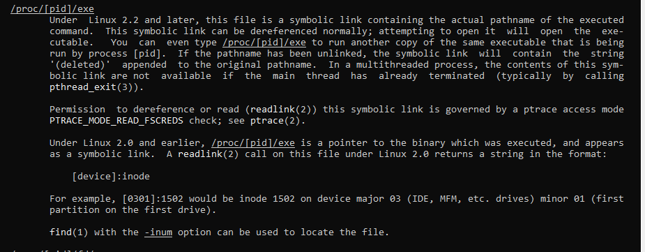

# Домашнее задание к занятию "Работа в терминале. Лекция 2"

### 1. Какого типа команда cd? Попробуйте объяснить, почему она именно такого типа: опишите ход своих мыслей, 
если считаете, что она могла бы быть другого типа.

cd - команда, встроенная в оболочку:


Немного странно, что другие команды, работающие с директориями, имеют другой тип:


Нашел историческую справку, в которой объясняется почему так произошло.

Цитирование Денниса Ричи:

```
В разгар нашего ликования было обнаружено, что команда chdir (изменить текущий каталог) перестала работать.
Было много чтения кода и тревожного самоанализа о том, как добавление fork могло нарушить вызов chdir. 
Наконец-то открылась истина: в старой системе chdir была обычной командой; 
она настраивала текущий каталог (уникального) процесса, подключенного к терминалу. 
В новой системе команда chdir корректно изменила текущий каталог процесса, созданного для ее выполнения, 
но этот процесс быстро завершился и не оказал никакого влияния на его родительскую оболочку! 
Необходимо было сделать chdir специальной командой, выполняемой внутри оболочки. 
Оказывается, что несколько командных функций имеют одно и то же свойство, например login.
```

### 2. Какая альтернатива без pipe команде grep <some_string> <some_file> | wc -l?

Бесполезное использование `wc -l`, приведенное в статье (на самом деле, остальная часть статьи осталась абсолютно непонятной):


Флаг, который нужно использовать:


Подсчитаю вхождение `if` в файл `.bashrc`:
1) Визуально
2) С помощью `wc -l`
3) С помощью `grep -c`:


Использование `wc` плохо по той причине, что для этого создается отдельный поток.

### 3. Какой процесс с PID 1 является родителем для всех процессов в вашей виртуальной машине Ubuntu 20.04?  

Командой `ps -efH` выведу дерево процессов с подробной информацией. Процесс с `PID=1` - `systemd`. Причем есть один процесс, 
который не является дочерним для `systemd`. Это процесс с `PID = 2` - `kthreadd`. Это мастер-процесс, создающий процессы для 
управления аппаратной составляющей, запускаемый ядром.


`Systemd` и дочерние процессы:


### 4. Как будет выглядеть команда, которая перенаправит вывод stderr ls на другую сессию терминала?  

Открою вторую сессию ssh. В новом терминале командой `tty` узнаю имя файла терминала - `/dev/pts/1`.
Перенаправлю вывод командой `ls -l \root 2>/dev/pts/1`


Альтернативный вариант узнать дескриптор терминала - вывести информацию о каталоге с процессом. (Номер процесса 
узнал в дереве процессов - правый терминал на скриншоте выше):


### 5. Получится ли одновременно передать команде файл на stdin и вывести ее stdout в другой файл? Приведите работающий пример.  

`cat <in.txt>out.txt`

### 6. Получится ли вывести находясь в графическом режиме данные из PTY в какой-либо из эмуляторов TTY? Сможете ли вы наблюдать выводимые данные?  

По идее, это именно то, что произошло в пункет 4.

### 7. Выполните команду `bash 5>&1`. К чему она приведет? Что будет, если вы выполните echo netology > /proc/$$/fd/5? Почему так происходит?  

Терминал в дереве процессов:


Дескрипторы терминала:


После выполнения команды `bash 5>&1` в дереве появилась новая строчка


А в дескрипторе появился еще один номер. Пятый поток перенаправляется в этот же терминал. Поэтому `echo netology` выводится в этом же окне:


### 8. Получится ли в качестве входного потока для pipe использовать только stderr команды, не потеряв при этом отображение stdout на pty?  

Чтобы это получилось воспроизвести, нужно чтобы до pipe было две команды - одна должна завершиться ошибкой, а другая иметь вывод.
Например, ls <Не существующий каталог> <Существующий каталог>. В выводе будет два типа сообщений:


Воспользовался буферным потоком из предыдущего задания:


### 9. Что выведет команда cat /proc/$$/environ? Как еще можно получить аналогичный по содержанию вывод?  

Эта команда выводит переменные окружения. Аналог - `printenv` (Но в этом случаае расставлены переносы строк)

### 10. Используя man, опишите что доступно по адресам /proc/<PID>/cmdline, /proc/<PID>/exe.  

cmdline - readonly файл содержащий полную командную строку для процесса, если этот процесс не является зомби.

exe - символическая ссылка на исполняемый файл

Выдержка из man:




#### 11. Узнайте, какую наиболее старшую версию набора инструкций SSE поддерживает ваш процессор с помощью /proc/cpuinfo.  

Максимальная версия - 4_2:


#### 12. При открытии нового окна терминала и vagrant ssh создается новая сессия и выделяется pty. Однако ... not a tty ... Почитайте, почему так происходит, и как изменить поведение.  

Нужно выполнить команду с флагом `-t`, чтобы переназначить псевдотелетайп

#### 13. Бывает, что есть необходимость переместить запущенный процесс из одной сессии в другую. Попробуйте сделать это, воспользовавшись reptyr.  


#### 14. Узнайте, что делает команда tee и почему в отличие от sudo echo команда с sudo tee будет работать.  

echo - команда, встроенная в оболочку, а значит наследует права оболочки (которая запущена без sudo). А команда tee - внешняя утилита, запускается с правами sudo, а значит отработает без проблем.
Потому что в команде используется каталог root, для записи в который нужны привилегии


