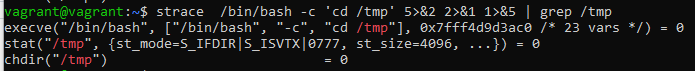
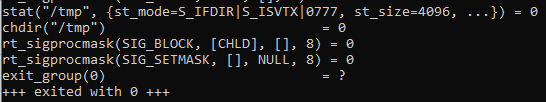
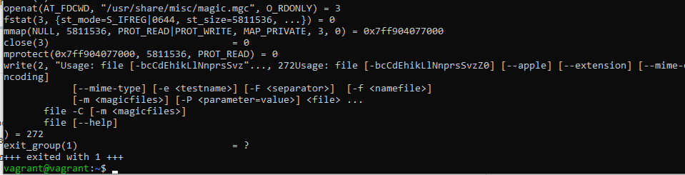
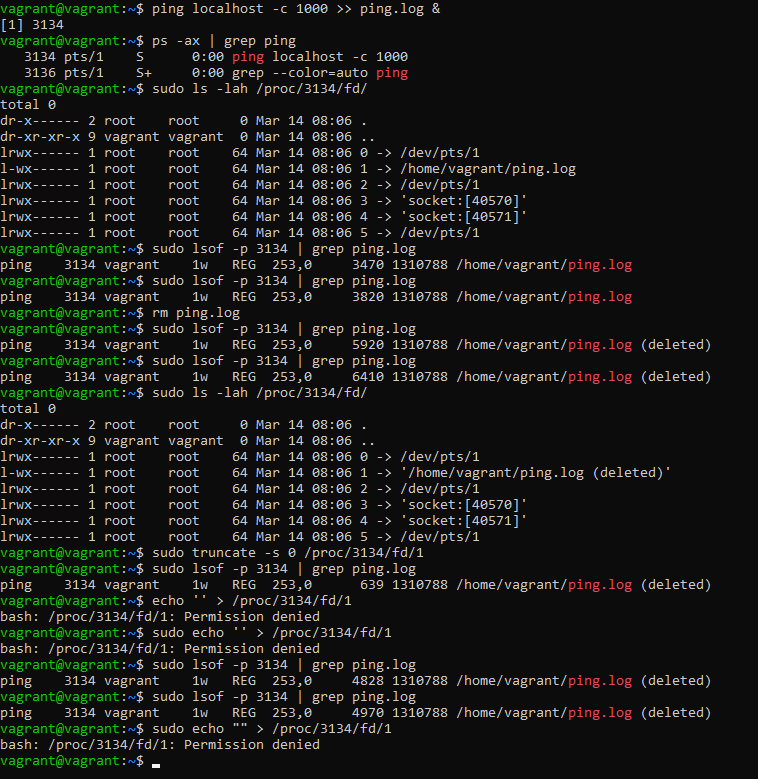
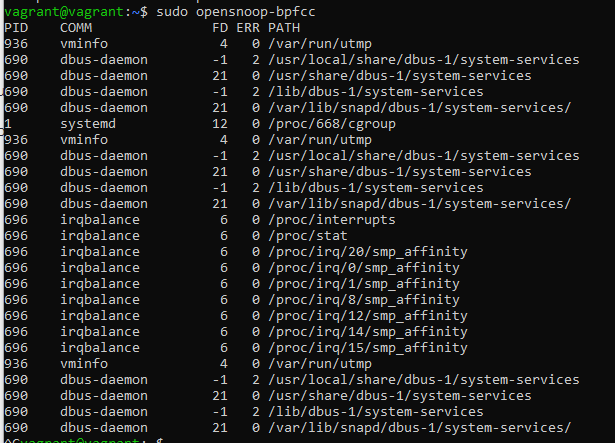
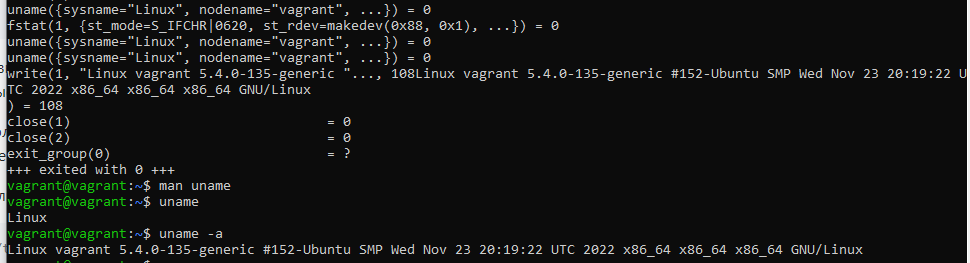
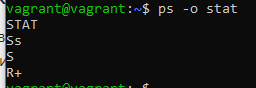
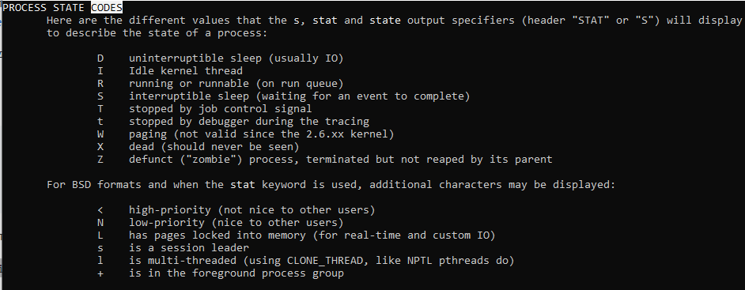

# Домашнее задание к занятию "Операционные системы. Лекция 1"

### 1. Какой системный вызов делает команда cd?

Ответ - chdir("/tmp")

### 2. Попробуйте использовать команду file на объекты разных типов в файловой системе. Используя strace выясните, где находится база данных file, на основании которой она делает свои догадки.

Вероятно, БД находится в "/usr/share/misc/magic.mgc".

Системный вызов:

openat(AT_FDCWD, "/usr/share/misc/magic.mgc", O_RDONLY) = 3

### 3. Основываясь на знаниях о перенаправлении потоков предложите способ обнуления открытого удаленного файла (чтобы освободить место на файловой системе).

Запустил пинг в фоне, который пишет в файл.

Узнал пид процесса.

Убедился, что вывод идет в файл.

Посмотрел размер файла и убедился, что он возрастает.

Удалил файл. Появился флаг, что файл удален, но размер все равно растет.

Командой `truncate` очистил файл - размер уменьшился.

Командой `echo` записать в удаленный файл не получилось

### 4. Занимают ли зомби-процессы какие-то ресурсы в ОС (CPU, RAM, IO)?

Нет, это просто строка в списке процессов

### 5. На какие файлы вы увидели вызовы группы open за первую секунду работы утилиты?

Что бы это ни значило:

### 6. Какой системный вызов использует uname -a? Приведите цитату из man по этому системному вызову, где описывается альтернативное местоположение в /proc, где можно узнать версию ядра и релиз ОС.

Системный вызов uname():

Часть информации из структуры utsname может быть получена также через sysctl и через /proc/sys/kernel/{ostype, hostname, osrelease, version, domainname}.  

### 7. Чем отличается последовательность команд через ; и через && в bash? Есть ли смысл использовать в bash &&, если применить set -e?

Разница в поведении. ';' - оператор разделитель, команды будут выполняться последовательно, независимо от результата выполнения соседних команд. 
А '&&' - логический оператор. Выполнение последовательных команд продолжится только в том случае, если все будут выполняться успешно. 

С точки зрения выполнения команд - разницы не будет. Но с точки зрения дальнейшего сопровождения - нужно будет помнить, что корректно команда будет 
работать только в том случае, если активирован `set -e`

### 8. Из каких опций состоит режим bash set -euxo pipefail и почему его хорошо было бы использовать в сценариях?

-e  Exit immediately if a command exits with a non-zero status.

-u  Treat unset variables as an error when substituting.

-x  Print commands and their arguments as they are executed.

-o option-name. Set the variable corresponding to option-name:
pipefail     the return value of a pipeline is the status of
                           the last command to exit with a non-zero status,
                           or zero if no command exited with a non-zero status

При такаом наборе удобно отслеживать выполнение скрипта и хорошо виден результат выполнения. А так же корректно обрабатывается ситуация его падения.

### 9. Используя -o stat для ps, определите, какой наиболее часто встречающийся статус у процессов в системе.

