# Домашнее задание к занятию "Операционные системы. Лекция 2"

### 1. На лекции мы познакомились с node_exporter. В демонстрации его исполняемый файл запускался в background. Этого достаточно для демо, но не для настоящей production-системы, где процессы должны находиться под внешним управлением. Используя знания из лекции по systemd, создайте самостоятельно простой unit-файл для node_exporter:

#### Поместите его в автозагрузку,
#### Предусмотрите возможность добавления опций к запускаемому процессу через внешний файл (посмотрите, например, на systemctl cat cron),
#### Удостоверьтесь, что с помощью systemctl процесс корректно стартует, завершается, а после перезагрузки автоматически поднимается.

Установил Prometheus и Prometheus-node-exporter:

`sudo apt install -y prometheus`

`sudo apt install -y prometheus-node-exporter`

Сервисы сразу запустились, причем автоматически добавилися автозапуск:

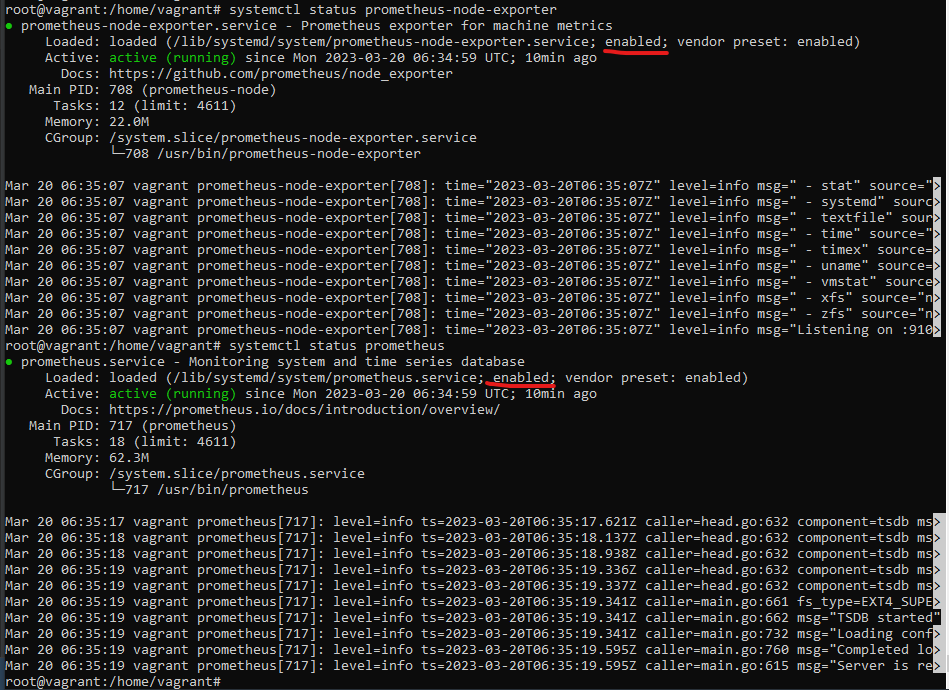

Чтобы подключаться к графическому интерфейсу, сделал проброс портов:

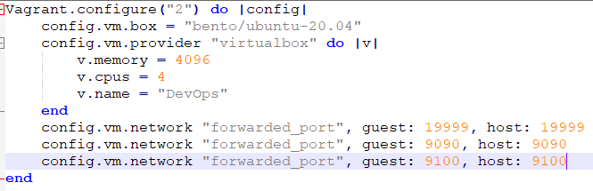

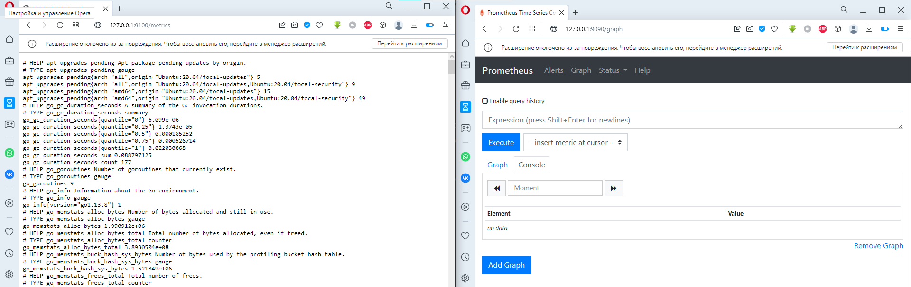

Изначально пытался сделать сетевой мост, но сервисы не были достуаны с хоста:

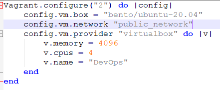

Потом попробовал назначить статический ip адрес, но в таком случае не смог подключиться через ssh:

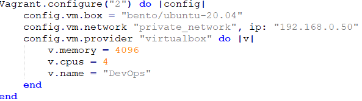

Решил, что проще пробросить порты, чем разбираться с сетями:)

Unit-файл, созданный автоматически при установке:

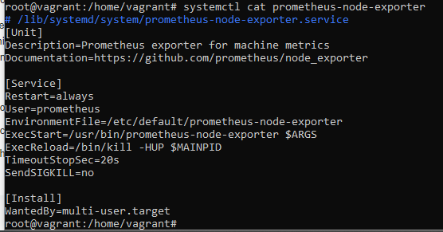

Возможность добавления опций через внешний файл предусмотрена по умолчанию:

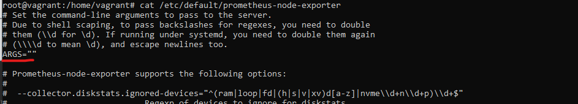

Сервис стртует и останавливается корректно:

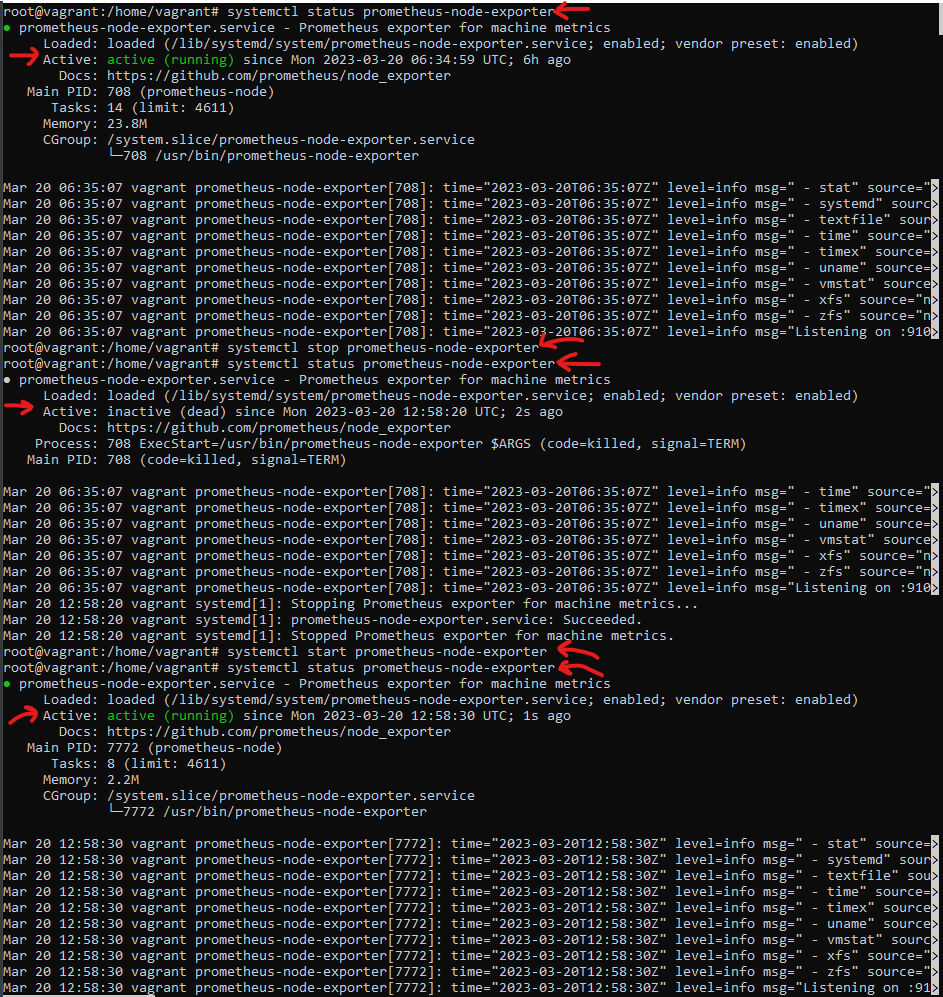

В том, что старт сервиса после рестарта системы происходит корректно, убедился после проброса портов.

### 2. Ознакомьтесь с опциями node_exporter и выводом /metrics по-умолчанию. Приведите несколько опций, которые вы бывыбрали для базового мониторинга хоста по CPU, памяти, диску и сети.

CPU:

node_cpu_guest_seconds_total Количество секунд, затраченных ЦП в гостевых (ВМ) для каждого режима.

node_cpu_seconds_total Количество секунд, потраченных процессором в каждом режиме.

Память:

node_memory_Buffers_bytes Поле информации о памяти Buffers_bytes.

node_memory_Cached_bytes Поле информации о памяти Cached_bytes.

node_memory_MemAvailable_bytes Поле информации о памяти MemAvailable_bytes.

node_memory_MemFree_bytes Поле информации о памяти MemFree_bytes.

node_memory_MemTotal_bytes Поле информации о памяти MemTotal_bytes.

node_memory_SwapCached_bytes Поле информации о памяти SwapCached_bytes.

node_memory_SwapFree_bytes Поле информации о памяти SwapFree_bytes.

node_memory_SwapTotal_bytes Поле информации о памяти SwapTotal_bytes.

Диск:

node_disk_io_now - Количество операций ввода-вывода, выполняемых в настоящее время.

node_disk_io_time_seconds_total Общее количество секунд, потраченных на операции ввода-вывода.

node_disk_read_time_seconds_total Общее количество секунд, потраченных на все операции чтения.

node_disk_write_time_seconds_total Это общее количество секунд, потраченных на все операции записи.

Сеть:

node_network_receive_bytes_total Network device statistic receive_bytes

node_network_receive_errs_total Network device statistic receive_errs

node_network_receive_multicast_total Network device statistic receive_multicast

node_network_receive_packets_total Network device statistic receive_packets

node_network_transmit_packets_total Network device statistic transmit_packets

node_network_transmit_errs_total Network device statistic transmit_errs

node_network_transmit_bytes_total Network device statistic transmit_bytes

### 3. Установите в свою виртуальную машину Netdata. Ознакомьтесь с метриками, которые по умолчанию собираются Netdata и с комментариями, которые даны к этим метрикам.

Проброс портов сделал ранее. После установки в конфигурационном файле раздела [web] не было:

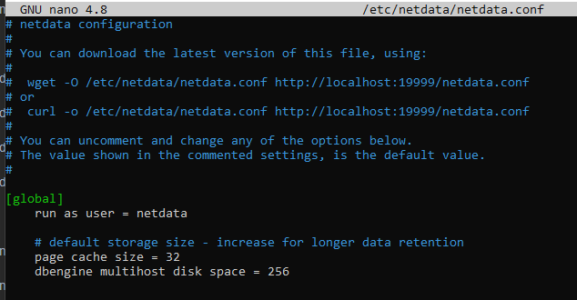

Сервис запустился корректно:

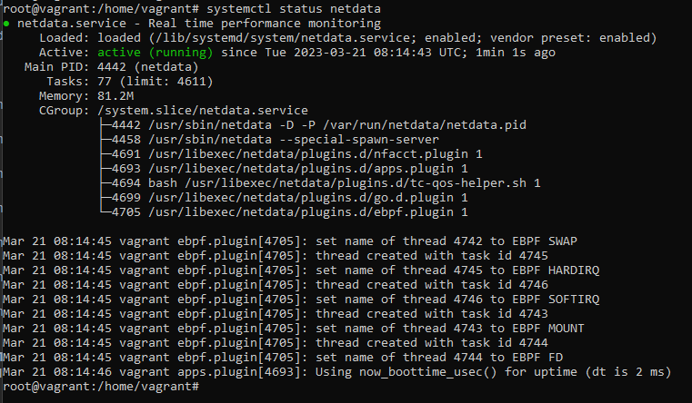

Веб интерфейс с хоста доступен:

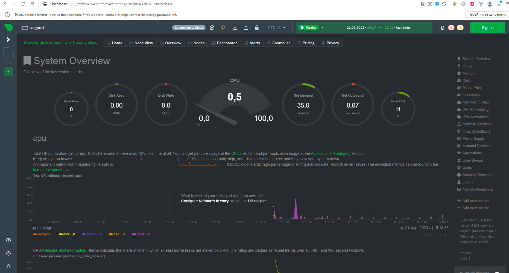

### 4. Можно ли по выводу dmesg понять, осознает ли ОС, что загружена не на настоящем оборудовании, а на системе виртуализации?

Да:

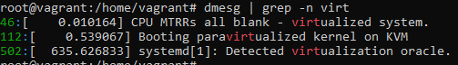

### 5. Как настроен sysctl fs.nr_open на системе по-умолчанию? Определите, что означает этот параметр. Какой другой существующий лимит не позволит достичь такого числа (ulimit --help)?

В мануале по sysctl нашел, где описываются параметры:

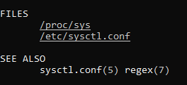

Значение переменной хранится в файле `proc/sys/fs/nr_open`. Так же его можно вывести непосредственно через sysctl:

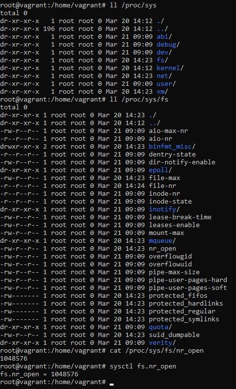

Описание переменной `nr_open` в мануалах не нашел. Только в интернете:

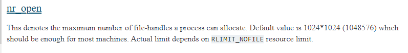

Аналогичное ограничение можно найти в ulimit:

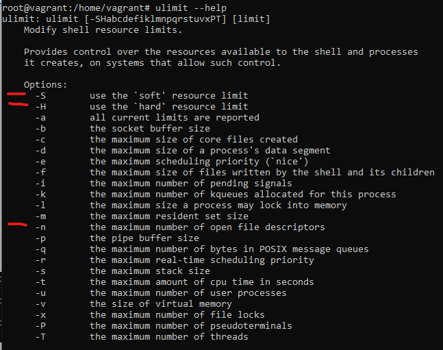

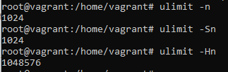

### 6. Запустите любой долгоживущий процесс (не ls, который отработает мгновенно, а, например, sleep 1h) в отдельном неймспейсе процессов; покажите, что ваш процесс работает под PID 1 через nsenter. Для простоты работайте в данном задании под root (sudo -i). Под обычным пользователем требуются дополнительные опции (--map-root-user) и т.д.

Через `unshare` запустил процесс в отдельном namespace. Чтобы консоль осталась активной, в конуц команды добавил `&`:

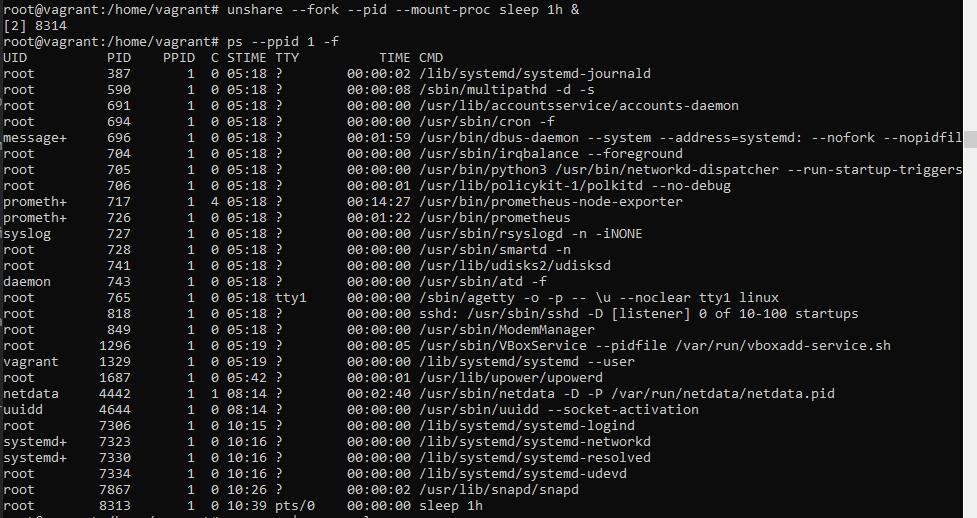

### 7. Найдите информацию о том, что такое :(){ :|:& };:. Запустите эту команду в своей виртуальной машине Vagrant с Ubuntu 20.04 (это важно, поведение в других ОС не проверялось). Некоторое время все будет "плохо", после чего (минуты) – ОС должна стабилизироваться. Вызов dmesg расскажет, какой механизм помог автоматической стабилизации. Как настроен этот механизм по-умолчанию, и как изменить число процессов, которое можно создать в сессии?

Эта функция рекурсивно вызывает два экземпляра этой же функции, быстро переполняя ресурсы машины:

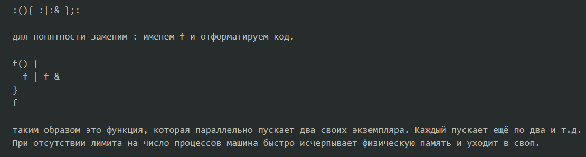

В моем случае этот процесс занял больше часа. Сыпались уведомления, а затем машина упала и не поднялась. Соответственно в выводе dmesg нет сообщения о том, какой механизм помог стабилизации. 

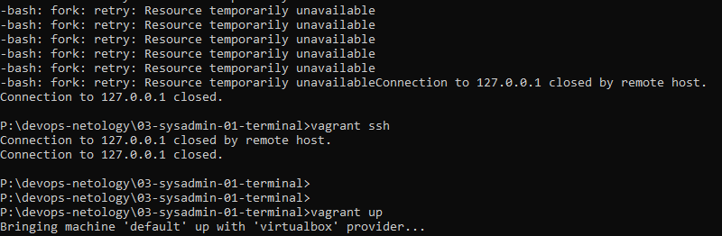

Попробовал еще раз. Нагрузка на систему выросла:

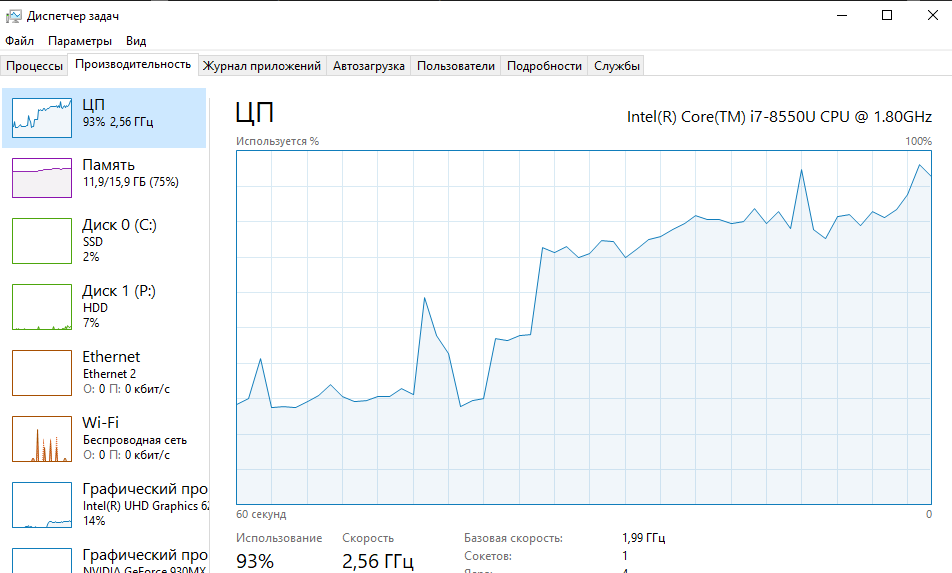

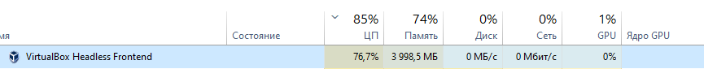

Но эта попытка снова ничем не закончилась - система просто зависла, а затем упала.

Ограничить количество процессов можно через `ulimit -u`
