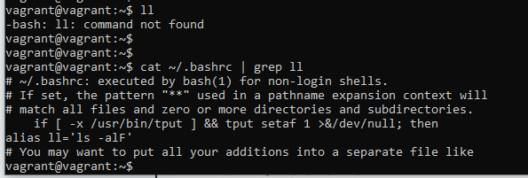
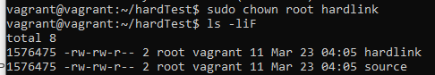
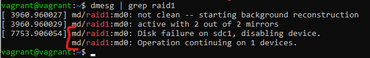

# Домашнее задание к занятию "Файловые системы"

Забавное замечание - после экспериментов из предыдущего задания перестали работать несколько функций, например `ll` (несмотря на то, что в конфиге bash она прописана):

### 1. Узнайте о sparse (разряженных) файлах.

### 2. Могут ли файлы, являющиеся жесткой ссылкой на один объект, иметь разные права доступа и владельца? Почему?

Не могут.

Одно из отличий символической ссылки от жесткой - тот факт, что жесткая ссылка ссылается на область памяти, а не на адрес файла.
Соответственно, все параметры должны быть одинаковые, например, ссылка имеет тот же номер inode:

После изменениея владельца:

После изменения прав:

### 3. Сделайте vagrant destroy на имеющийся инстанс Ubuntu. Замените содержимое Vagrantfile следующим. Данная конфигурация создаст новую виртуальную машину с двумя дополнительными неразмеченными дисками по 2.5 Гб.

### 4. Используя fdisk, разбейте первый диск на 2 раздела: 2 Гб, оставшееся пространство.

С помощью интерактивного режима fdisk создал два раздела на диске /dev/sdb:

### 5. Используя sfdisk, перенесите данную таблицу разделов на второй диск.

### 6. Соберите mdadm RAID1 на паре разделов 2 Гб.

### 7. Соберите mdadm RAID0 на второй паре маленьких разделов.

Вероятно, следовало бы поменять индексы у `md`, чтобы они соответствовали типу RAID (просто чтобы было красиво:)

### 8. Создайте 2 независимых PV на получившихся md-устройствах.

### 9. Создайте общую volume-group на этих двух PV.

### 10. Создайте LV размером 100 Мб, указав его расположение на PV с RAID0.

### 11. Создайте mkfs.ext4 ФС на получившемся LV.

### 12. Смонтируйте этот раздел в любую директорию, например, /tmp/new.

`sudo mount /dev/vg_md0_md1/lvol0 /tmp/new`

### 13. Поместите туда тестовый файл, например wget https://mirror.yandex.ru/ubuntu/ls-lR.gz -O /tmp/new/test.gz.

### 14. Прикрепите вывод lsblk.

### 15. Протестируйте целостность файла:

### 16. Используя pvmove, переместите содержимое PV с RAID0 на RAID1.

### 17. Сделайте --fail на устройство в вашем RAID1 md.

### 18. Подтвердите выводом dmesg, что RAID1 работает в деградированном состоянии.

### 19. Протестируйте целостность файла, несмотря на "сбойный" диск он должен продолжать быть доступен:

