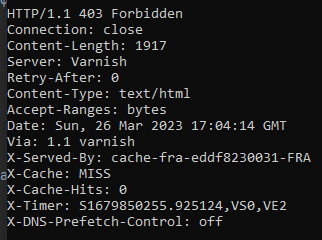

# Домашнее задание к занятию "Компьютерные сети. Лекция 1"

### 1. Работа c HTTP через telnet.

Ответ на команду 
```
telnet stackoverflow.com 80
GET /questions HTTP/1.0
HOST: stackoverflow.com
```



Расшифровка:

- HTTP 403 Forbidden — стандартный код ответа HTTP, означающий, что доступ к запрошенному ресурсу запрещен.
- Подключение закрыто
- Content-Length заголовка указывает размер тела сообщения, в байтах, отправляется получателю.
- Заголовок Server описывает программное обеспечение, используемое исходным сервером, обработавшим запрос, то есть сервером, сгенерировавшим ответ. Varnish – это прокси-сервер, ориентированный на кеширование http-запросов. Он разработан как ускоритель http и может действовать как реверс-прокси
- Retry-After ответа HTTP заголовка указывает на то, как долго агент пользователя должен подождать , прежде чем сделать последующий запрос.
- Content-Type заголовок представления используется , чтобы указать исходный тип носителя ресурса (до любого кодирования контента применяется для отправки).
- В Accept-Ranges HTTP заголовок ответа является маркером , используемым сервером , чтобы рекламировать свою поддержку частичных запросов от клиента для загрузки файлов. Значение этого поля указывает единицу измерения, которую можно использовать для определения диапазона.
- Общий HTTP-заголовок Date содержит дату и время создания сообщения.
- Via общий заголовок добавляется прокси - сервера, вперед и назад, и может появляться в запросе или ответ заголовках. Он используется для отслеживания пересылки сообщений, предотвращения зацикливания запросов и определения возможностей протокола отправителей в цепочке запросов / ответов.
- X-Served-By содержит идентификатор кэш-сервера
- X-Cache соответствует результату, обработал ли прокси результат из кеша (HIT для да и MISS для нет)
- X-Cache-Hits заголовок записывает значение obj.hits переменной VCL, которая является локальной для отдельного узла кэша . Чтобы оптимизировать и сбалансировать нагрузку
- X-Timer содержит информацию о сроках ответа
- В X-DNS-Prefetch-Control контролирует заголовок ответа HTTP DNS упреждающая выборка, функция , с помощью которого браузеры активно выполнять разрешение доменных имен на обеих ссылок , которые пользователь может выбрать , чтобы следовать, а также URL - адреса для элементов , упоминаемых в документе, в том числе изображений, CSS , JavaScript и так далее. 

### 2.  Повторите задание 1 в браузере, используя консоль разработчика

Самый первый запрос - завершился кодом 307. 

```
307 Temporary Redirect — запрашиваемый ресурс на короткое время доступен по другому URI, указанный в поле Location заголовка. 
Метод запроса (GET/POST) менять не разрешается. Например, POST-запрос должен быть отправлен по новому URI тем же методом POST. 
Этот код был введён вместе с 303-м вместо 302-го для избежания неоднозначности. Введено в RFC 2616 (обновление HTTP/1.1).
```


Поэтому, вероятно, нас интересует второй запрос:


В заголовке намного больше параметров, нежели в первом задании. Скорее всего, это напряму связано с кодом возврата HTTP.

Больше всего заняло времени - ожидание ответа сервера:


### 3. Какой IP-адрес у вас в интернете?

ip адрес через 2ip.com:


ip дрес через панель управления домашним маршрутизатором (серый ip от провайдера):


### 4. Какому провайдеру принадлежит ваш IP-адрес? Какой автономной системе AS? Воспользуйтесь утилитой whois.


### 5. Через какие сети проходит пакет, отправленный с вашего компьютера на адрес 8.8.8.8? Через какие AS? Воспользуйтесь утилитой traceroute


### 6. Повторите задание 5 в утилите mtr. На каком участке наибольшая задержка — delay?

Номера AS совпадают, за исключением того, что в traceroute в 21 хопе указано два варианта, а в mtu только один.

Максимальная задержка на десятом хопе:


### 7. Какие DNS-сервера отвечают за доменное имя dns.google? Какие A-записи? Воспользуйтесь утилитой dig.

```
Запись A — это запись, указывающая соответствие доменного имени и IPv4-адреса. В домене второго уровня domain.ru обычно 
создаются запись A вида www, mail, ftp и так далее, обеспечивающие работу имён вида www.domain.ru, mail.domain.ru, 
ftp.domain.ru. Для IPv6-адресов создаются АААА-записи.
```


### 8. Проверьте PTR записи для IP-адресов из задания 7. Какое доменное имя привязано к IP? Воспользуйтесь утилитой dig.

```
PTR — обратная DNS-запись, которая связывает IP-адрес сервера с его каноническим именем (доменом)
```


