# Домашнее задание к занятию "Компьютерные сети. Лекция 2"

### 1. Проверьте список доступных сетевых интерфейсов на вашем компьютере. Какие команды есть для этого в Linux и в Windows?

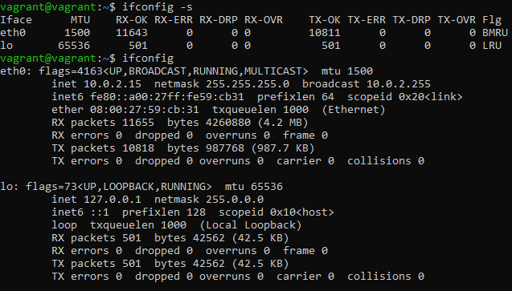

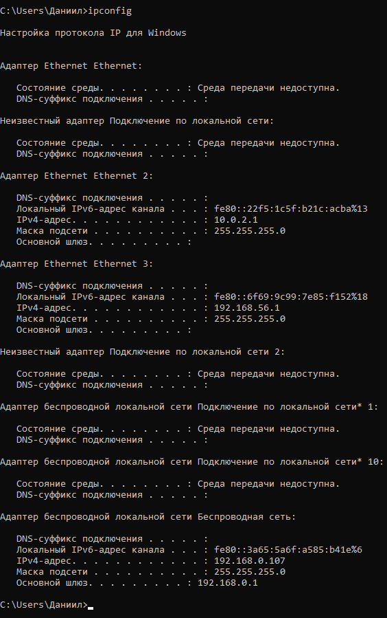

### 2. Какой протокол используется для распознавания соседа по сетевому интерфейсу? Какой пакет и команды есть в Linux для этого? 

```
Протокол обнаружения соседей (англ. Neighbor Discovery Protocol, NDP ) — протокол из набора протоколов TCP/IP, 
используемый совместно с IPv6. Он работает на сетевом уровне Модели Интернета (RFC 1122) и ответственен за 
автонастройку адреса конечных и промежуточных точек сети, обнаружения других узлов на линии, определения 
адреса других узлов канального уровня, обнаружение конфликта адресов, поиск доступных маршрутизаторов и 
DNS-серверов, определения префикса адреса и поддержки доступности информации о путях к другим активным 
соседним узлам (RFC 4861).
```

```
Link Layer Discovery Protocol (LLDP) — протокол канального уровня, позволяющий сетевому оборудованию оповещать оборудование,
работающее в локальной сети, о своём существовании и передавать ему свои характеристики, а также получать от него
аналогичные сведения.
```
Использование протокола LLDP в Linux:

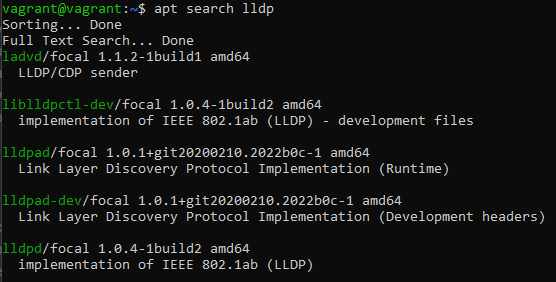

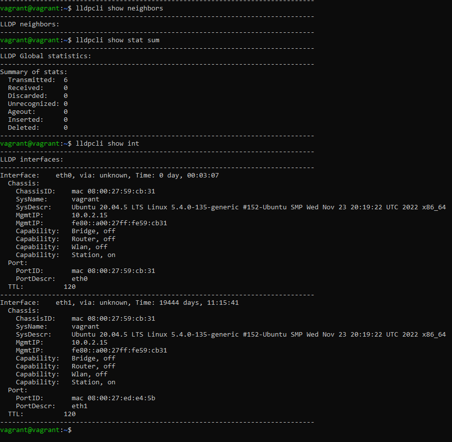

### 3. Какая технология используется для разделения L2 коммутатора на несколько виртуальных сетей? Какой пакет и команды есть в Linux для этого? Приведите пример конфига.

```
VLAN – это аббревиатура, означающая Virtual Local Area Network (виртаульная локальная сеть). На одном физическом порту 
может совместно существовать несколько VLAN-сетей, которые настраиваются программными средствами Linux, а не 
конфигурацией физических интерфейсов (но настройка самих интерфейсов тоже требуется). С помощью VLAN можно разделить 
сетевые ресурсы для использования различных сервисов.
```
Создам VLAN:

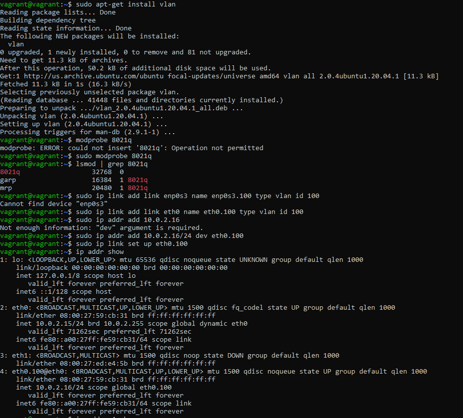

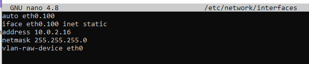

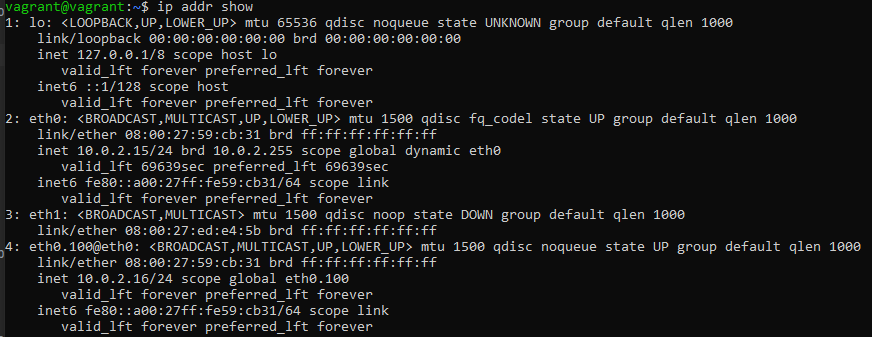

```
Ремарка после выполнения оставшихся заданий. Вероятно, VLAN`у назначена неправильная маска.  
```

Появился новый интерфейс. Правда затрудняюсь понять - работает он или нет. И путаница с ip адресами осталась.

Вопрос 1. Правильно ли я понимаю, у linux есть физический интерфейс eth0 с адресом 10.0.2.15 . Мы можем на этом физическом 
интерфейсе создать VLAN - внутреннюю сеть, из которой вырваться наружу можно только через маршрутизатор, а обратиться к узлам в ней из вне - не проблема.

Вопрос 2. "Из вне" VLAN будет доступен по адресу 10.0.2.16 ?

Вопрос 3. Какой диапазон адресов внутри VLAN?

Вопрос 4. Как проверить его работоспособность?

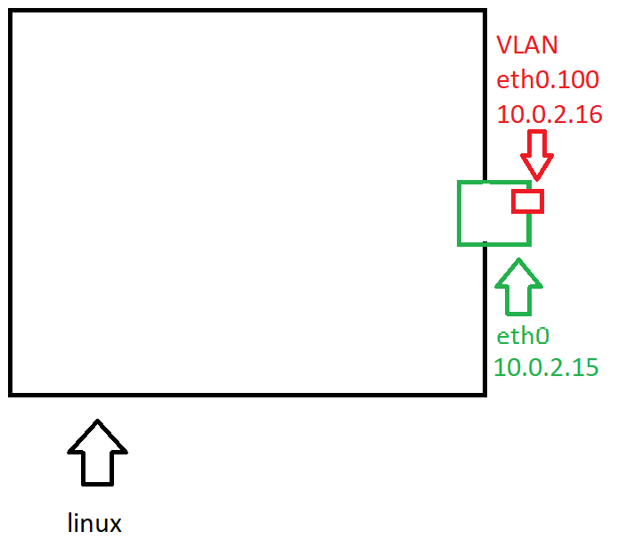


### 4. Какие типы агрегации интерфейсов есть в Linux? Какие опции есть для балансировки нагрузки? Приведите пример конфига.

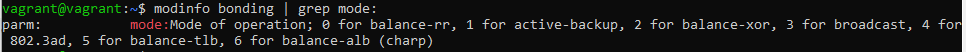

mode=0 (balance-rr)
При этом методе объединения трафик распределяется по принципу «карусели»: пакеты по очереди направляются на сетевые карты объединённого интерфейса. Например, если у нас есть физические интерфейсы eth0, eth1, and eth2, объединенные в bond0, первый пакет будет отправляться через eth0, второй — через eth1, третий — через eth2, а четвертый снова через eth0 и т.д.

mode=1 (active-backup)
Когда используется этот метод, активен только один физический интерфейс, а остальные работают как резервные на случай отказа основного.

mode=2 (balance-xor)
В данном случае объединенный интерфейс определяет, через какую физическую сетевую карту отправить пакеты, в зависимости от MAC-адресов источника и получателя.

mode=3 (broadcast) Широковещательный режим, все пакеты отправляются через каждый интерфейс. Имеет ограниченное применение, но обеспечивает значительную отказоустойчивость.

mode=4 (802.3ad)
Особый режим объединения. Для него требуется специально настраивать коммутатор, к которому подключен объединенный интерфейс. Реализует стандарты объединения каналов IEEE и обеспечивает как увеличение пропускной способности, так и отказоустойчивость.

mode=5 (balance-tlb)
Распределение нагрузки при передаче. Входящий трафик обрабатывается в обычном режиме, а при передаче интерфейс определяется на основе данных о загруженности.

mode=6 (balance-alb)
Адаптивное распределение нагрузки. Аналогично предыдущему режиму, но с возможностью балансировать также входящую нагрузку.

Пример конфига бэкапа:

```
auto bond0
iface bond0 inet dhcp
   bond-slaves eth0 eth1
   bond-mode active-backup
   bond-miimon 100
   bond-primary eth0 eth1
```

### 5. Сколько IP адресов в сети с маской /29 ? Сколько /29 подсетей можно получить из сети с маской /24. Приведите несколько примеров /29 подсетей внутри сети 10.10.10.0/24.

Binary Subnet Mask:	11111111.11111111.11111111.11111000

2^3 = 8 - Восемь адресов в сети с маской /29. Из них доступно только шесть, потому что один отведен под broadcast, а второй под адрес сети.

В сети с маской /24 - 256 адресов. Значит в ней содержится 32 сети с маской /29 (256 / 8 = 32).

Например:

- 10.10.10.0/29
- 10.10.10.8/29
- 10.10.10.32/29
- 10.10.10.240/29
- 10.10.10.248/29


### 6. Задача: вас попросили организовать стык между 2-мя организациями. Диапазоны 10.0.0.0/8, 172.16.0.0/12, 192.168.0.0/16 уже заняты. Из какой подсети допустимо взять частные IP адреса? Маску выберите из расчета максимум 40-50 хостов внутри подсети.

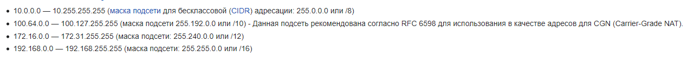

Из частных сетей осталась только сеть 100.64.0.0/10 .

Из нее можно выделить подсеть с маской /26. Она будет включать в себя 64 адресы (Из них получится использовать 62, чего вполне достаточно)

### 7. Как проверить ARP таблицу в Linux, Windows? Как очистить ARP кеш полностью? Как из ARP таблицы удалить только один нужный IP?

В Windows для этого служит команда `arp -a`. В Linux:

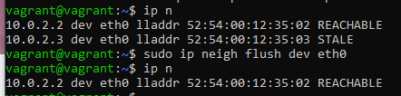

Для удаления конкретной записи можно воспользоваться командой
`sudo ip neigh del dev <Интерфейс> <IP>`

### 8. Установите эмулятор EVE-ng. Выполните задания на lldp, vlan, bonding в эмуляторе EVE-ng.

Продукция VMware, как и VirtualBox, использует модуль Hyper-V, поэтому эти два продукта не совместимы на одном устройстве.
И чтобы запустить виртуальную маштну VMware нужно постоянно включать соответствующий компонент, что накладно.

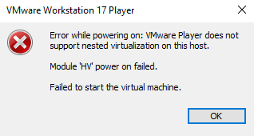

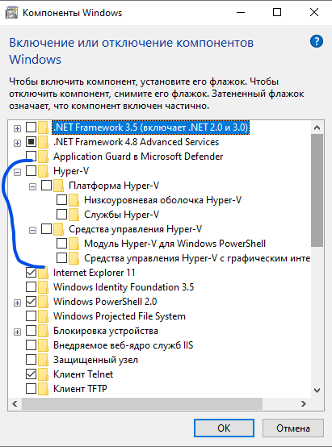


