# Домашнее задание к занятию "Компьютерные сети. Лекция 3"

### 1. Подключитесь к публичному маршрутизатору в интернет. Найдите маршрут к вашему публичному IP
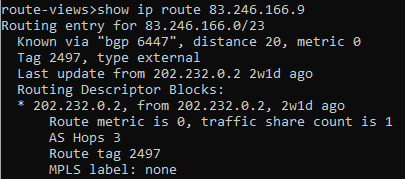

```
BGP routing table entry for 83.246.166.0/23, version 2766278181
Paths: (20 available, best #18, table default)
  Not advertised to any peer
  Refresh Epoch 1
  3267 20485 31364
    194.85.40.15 from 194.85.40.15 (185.141.126.1)
      Origin IGP, metric 0, localpref 100, valid, external
      path 7FE0D5216358 RPKI State not found
      rx pathid: 0, tx pathid: 0
  Refresh Epoch 1
  3549 3356 20485 31364
    208.51.134.254 from 208.51.134.254 (67.16.168.191)
      Origin IGP, metric 0, localpref 100, valid, external
      Community: 3356:2 3356:22 3356:100 3356:123 3356:501 3356:903 3356:2065 3549:2581 3549:30840 20485:10022 20485:65102
      path 7FE0BABF7A58 RPKI State not found
      rx pathid: 0, tx pathid: 0
  Refresh Epoch 1
  20912 3257 1299 20485 31364
    212.66.96.126 from 212.66.96.126 (212.66.96.126)
      Origin IGP, localpref 100, valid, external
      Community: 3257:8066 3257:30055 3257:50001 3257:53900 3257:53902 20912:65004
      path 7FE03B99C430 RPKI State not found
      rx pathid: 0, tx pathid: 0
  Refresh Epoch 1
  20130 6939 20485 31364
    140.192.8.16 from 140.192.8.16 (140.192.8.16)
      Origin IGP, localpref 100, valid, external
      path 7FE15EA82E68 RPKI State not found
      rx pathid: 0, tx pathid: 0
  Refresh Epoch 1
  3356 20485 31364
    4.68.4.46 from 4.68.4.46 (4.69.184.201)
      Origin IGP, metric 0, localpref 100, valid, external
      Community: 3356:2 3356:22 3356:100 3356:123 3356:501 3356:903 3356:2065 20485:10022 20485:65102
      path 7FE04E57CD38 RPKI State not found
      rx pathid: 0, tx pathid: 0
  Refresh Epoch 1
  852 3491 20485 20485 31364
    154.11.12.212 from 154.11.12.212 (96.1.209.43)
      Origin IGP, metric 0, localpref 100, valid, external
      path 7FE1279782C8 RPKI State not found
      rx pathid: 0, tx pathid: 0
  Refresh Epoch 1
  57866 9002 20485 31364
    37.139.139.17 from 37.139.139.17 (37.139.139.17)
      Origin IGP, metric 0, localpref 100, valid, external
      Community: 9002:9002 9002:64667 57866:100 65100:9002 65103:1 65104:31
      unknown transitive attribute: flag 0xE0 type 0x20 length 0x30
        value 0000 E20A 0000 0064 0000 232A 0000 E20A
              0000 0065 0000 0064 0000 E20A 0000 0067
              0000 0001 0000 E20A 0000 0068 0000 001F

      path 7FE12E600590 RPKI State not found
      rx pathid: 0, tx pathid: 0
  Refresh Epoch 1
  3333 1273 20485 31364
    193.0.0.56 from 193.0.0.56 (193.0.0.56)
      Origin IGP, localpref 100, valid, external
      Community: 1273:12752 1273:30000 20485:10022 20485:65102
      path 7FE0238ABE98 RPKI State not found
      rx pathid: 0, tx pathid: 0
  Refresh Epoch 1
  49788 12552 20485 31364
    91.218.184.60 from 91.218.184.60 (91.218.184.60)
      Origin IGP, localpref 100, valid, external
      Community: 12552:12000 12552:12600 12552:12601 12552:22000
      Extended Community: 0x43:100:1
      path 7FE1238926C0 RPKI State not found
      rx pathid: 0, tx pathid: 0
  Refresh Epoch 1
  8283 1299 20485 31364
    94.142.247.3 from 94.142.247.3 (94.142.247.3)
      Origin IGP, metric 0, localpref 100, valid, external
      Community: 1299:30000 8283:1 8283:101
      unknown transitive attribute: flag 0xE0 type 0x20 length 0x18
        value 0000 205B 0000 0000 0000 0001 0000 205B
              0000 0005 0000 0001
      path 7FE0D6CD5688 RPKI State not found
      rx pathid: 0, tx pathid: 0
  Refresh Epoch 1
  7018 3356 20485 31364
    12.0.1.63 from 12.0.1.63 (12.0.1.63)
      Origin IGP, localpref 100, valid, external
      Community: 7018:5000 7018:37232
      path 7FE12A27CE20 RPKI State not found
      rx pathid: 0, tx pathid: 0
  Refresh Epoch 1
  19214 3257 1299 20485 31364
    208.74.64.40 from 208.74.64.40 (208.74.64.40)
      Origin IGP, localpref 100, valid, external
      Community: 3257:8108 3257:30391 3257:50002 3257:51200 3257:51203
      path 7FE095C87ED8 RPKI State not found
      rx pathid: 0, tx pathid: 0
  Refresh Epoch 1
  101 3491 20485 20485 31364
    209.124.176.223 from 209.124.176.223 (209.124.176.223)
      Origin IGP, localpref 100, valid, external
      Community: 101:20300 101:22100 3491:300 3491:311 3491:9001 3491:9080 3491:9081 3491:9087 3491:62210 3491:62220 20485:10022 20485:65102
      path 7FE114452320 RPKI State not found
      rx pathid: 0, tx pathid: 0
  Refresh Epoch 1
  1351 6939 20485 31364
    132.198.255.253 from 132.198.255.253 (132.198.255.253)
      Origin IGP, localpref 100, valid, external
      path 7FE1CB472768 RPKI State not found
      rx pathid: 0, tx pathid: 0
  Refresh Epoch 1
  6939 20485 31364
    64.71.137.241 from 64.71.137.241 (216.218.253.53)
      Origin IGP, localpref 100, valid, external
      path 7FE088EB1388 RPKI State not found
      rx pathid: 0, tx pathid: 0
  Refresh Epoch 1
  4901 6079 1299 20485 31364
    162.250.137.254 from 162.250.137.254 (162.250.137.254)
      Origin IGP, localpref 100, valid, external
      Community: 65000:10100 65000:10300 65000:10400
      path 7FE0CAA95988 RPKI State not found
      rx pathid: 0, tx pathid: 0
  Refresh Epoch 1
  3303 20485 31364
    217.192.89.50 from 217.192.89.50 (138.187.128.158)
      Origin IGP, localpref 100, valid, external
      Community: 3303:1004 3303:1006 3303:1030 3303:1031 3303:3056 20485:10022 20485:65102 65101:1082 65102:1000 65103:276 65104:150
      path 7FE0E16F3130 RPKI State not found
      rx pathid: 0, tx pathid: 0
  Refresh Epoch 2
  2497 20485 31364
    202.232.0.2 from 202.232.0.2 (58.138.96.254)
      Origin IGP, localpref 100, valid, external, best
      path 7FE161DD9630 RPKI State not found
      rx pathid: 0, tx pathid: 0x0
  Refresh Epoch 1
  3561 3910 3356 20485 31364
    206.24.210.80 from 206.24.210.80 (206.24.210.80)
      Origin IGP, localpref 100, valid, external
      path 7FE0BEC3DEC8 RPKI State not found
      rx pathid: 0, tx pathid: 0
  Refresh Epoch 1
  3257 1299 20485 31364
    89.149.178.10 from 89.149.178.10 (213.200.83.26)
      Origin IGP, metric 10, localpref 100, valid, external
      Community: 3257:8794 3257:30052 3257:50001 3257:54900 3257:54901
      path 7FE0F7C72788 RPKI State not found
      rx pathid: 0, tx pathid: 0
```

### 2. Создайте dummy0 интерфейс в Ubuntu. Добавьте несколько статических маршрутов. Проверьте таблицу маршрутизации.

Создал интерфейс dummy:

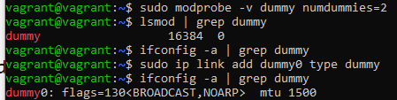

Проверил таблицу маршрутизации до внесения изменений:

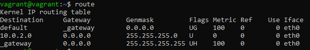

Присвоил интерфейсу ip адрес:

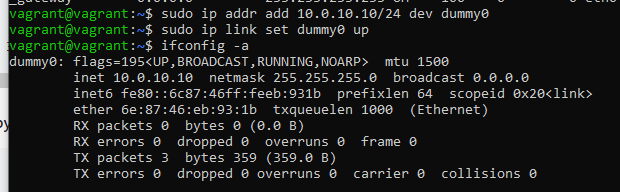

Добавил статические маршруты:

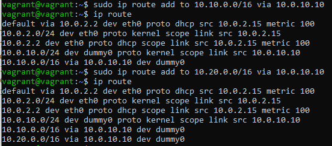

Разные способы вывести маршруты:

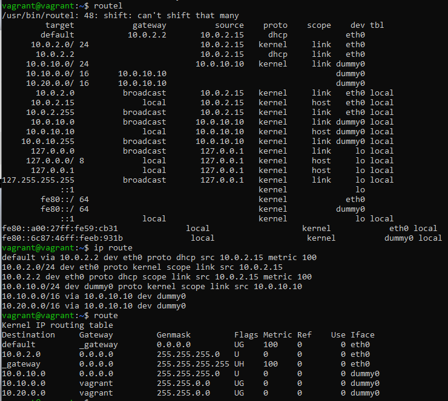

### 3. Проверьте открытые TCP порты в Ubuntu, какие протоколы и приложения используют эти порты? Приведите несколько примеров.

53 tcp порт использует systemd-resolve, 22 порт - sshd

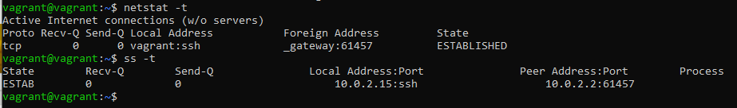

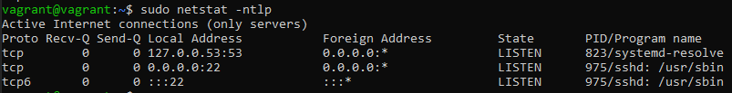


### 4. Проверьте используемые UDP сокеты в Ubuntu, какие протоколы и приложения используют эти порты?

Порты 53 и 68 не прослушиваются, но могут использоваться systemd-resolve и systemd-network соответственно:

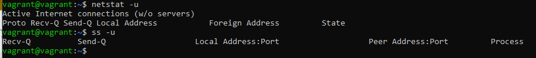

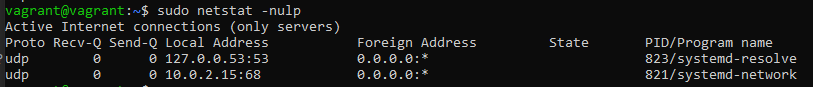

### 5. Используя diagrams.net, создайте L3 диаграмму вашей домашней сети или любой другой сети, с которой вы работали.

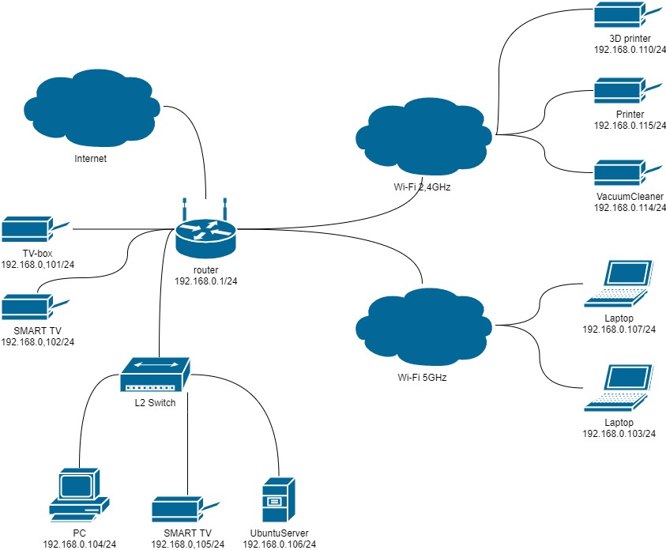


