# Домашнее задание к занятию "Компьютерные сети. Лекция 3"

### 1. Установите Bitwarden плагин для браузера. Зарегестрируйтесь и сохраните несколько паролей.

Установил расширение в браузер Opera:

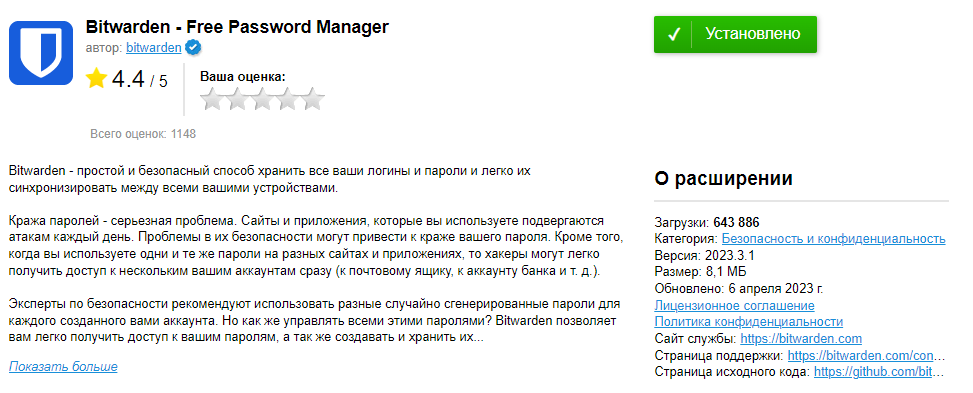

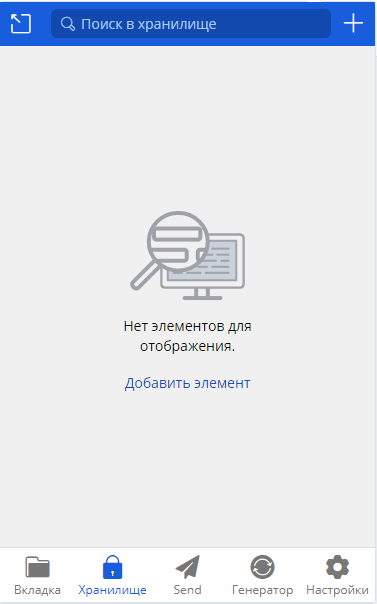

Добавил данные для обачных хранилищ:

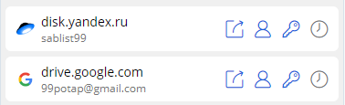

### 2. Установите Google authenticator на мобильный телефон. Настройте вход в Bitwarden акаунт через Google authenticator OTP.
 
Авторизовался на сайте и добавил аутентификацию через GA (скриншота из приложения нет, так как приложение запрешает делать скриншоты:)

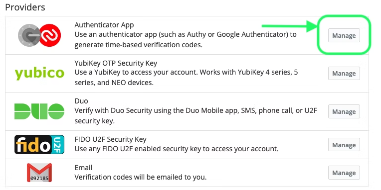

### 3. Установите Google authenticator на мобильный телефон. Настройте вход в Bitwarden акаунт через Google authenticator OTP.

Воспользуюсь виртуальной машиной Ubuntu с графическим интерфейсом.

Создал сертификат:

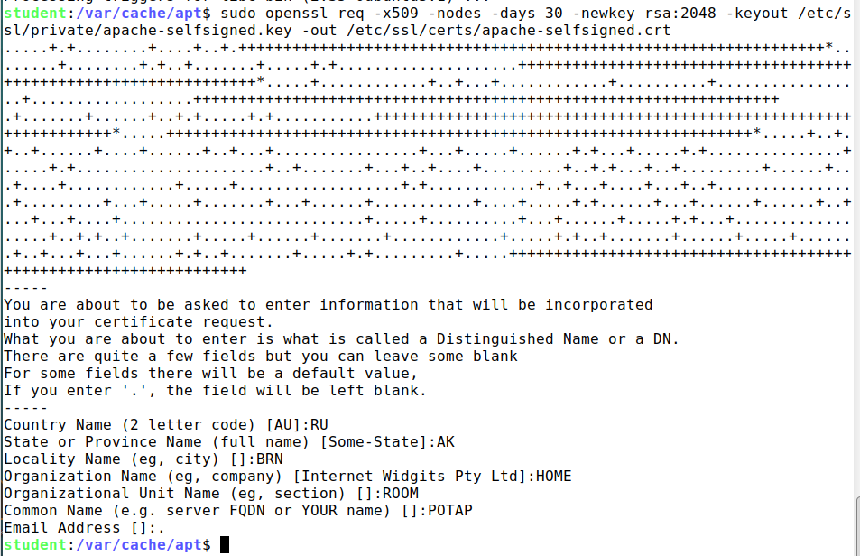

Для безопасной настройки Apache SSL испоьзую рекомендации Реми ван Эльста на сайте Cipherli.st. 
Этот сайт создан для предоставления удобных настроек шифрования для популярного программного обеспечения.

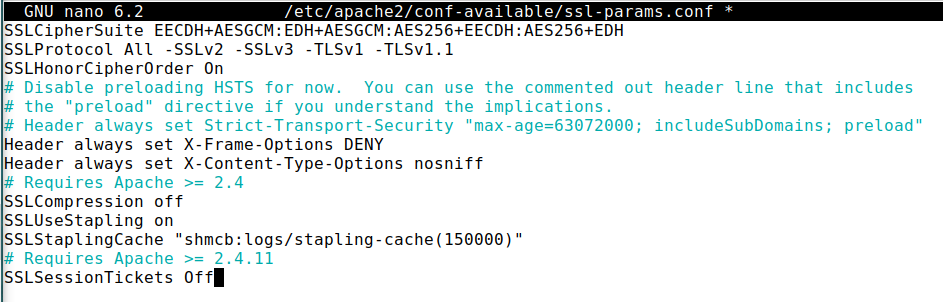

Внес изменение в конфигурацию виртуального хоста:

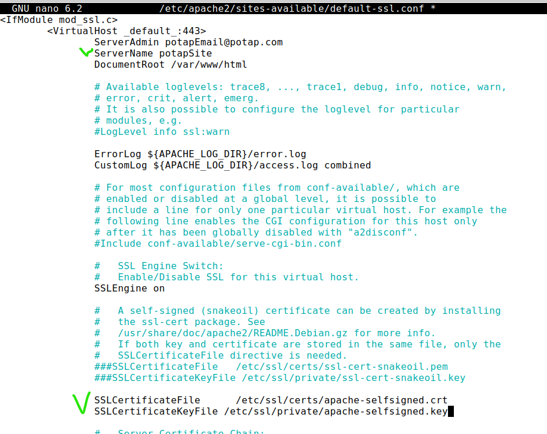

Изменение файла хоста HTTP:

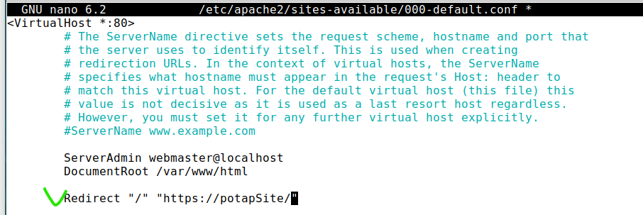

Активировал все необходимые модули и перезагрузил Apache:

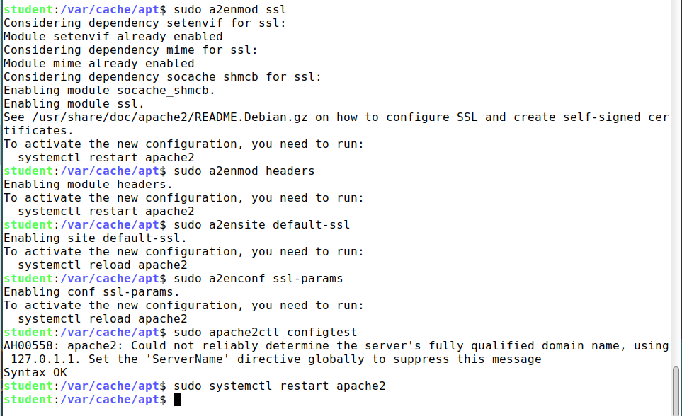

Попасть по адресу https://potapsite так и не получилось, вероятно, где-то ошибка в конфигах (или что-то не сделал).

Потому в фвйле /etc/hosts прописал ip адрес ВМ для сайт vk.com:

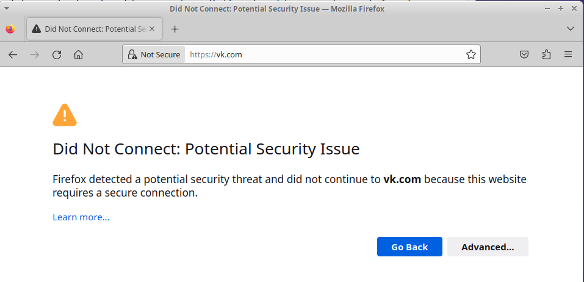

Сертификат:

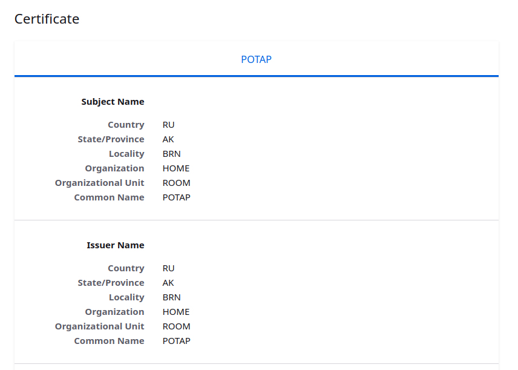

### 4. Проверьте на TLS уязвимости произвольный сайт в интернете (кроме сайтов МВД, ФСБ, МинОбр, НацБанк, РосКосмос, РосАтом, РосНАНО и любых госкомпаний, объектов КИИ, ВПК ... и тому подобное).

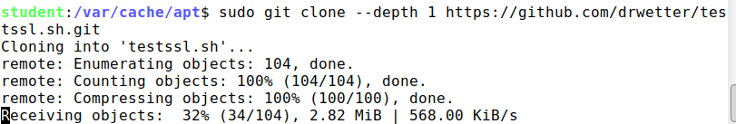

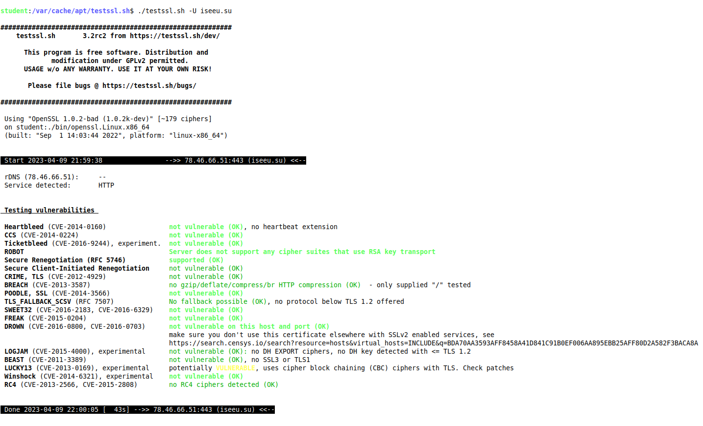

### 5.  Установите на Ubuntu ssh сервер, сгенерируйте новый приватный ключ. Скопируйте свой публичный ключ на другой сервер. Подключитесь к серверу по SSH-ключу.

Сгенерировал ключи:

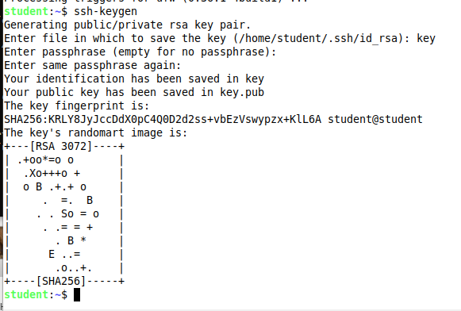

Отправил ключ на localhost:

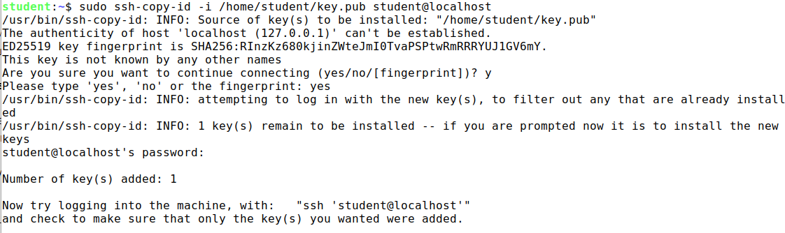

Подключился к тому же хосту:

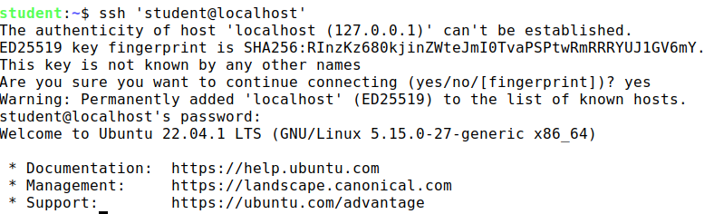

### 6.  Переименуйте файлы ключей из задания 5. Настройте файл конфигурации SSH клиента, так чтобы вход на удаленный сервер осуществлялся по имени сервера.

Переименовал файлы ключей и создал файл конфигурации:

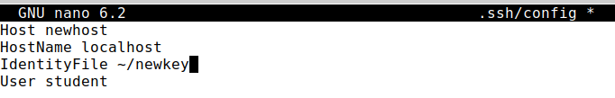

Подключился по имени:

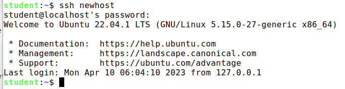

### 7. Соберите дамп трафика утилитой tcpdump в формате pcap, 100 пакетов. Откройте файл pcap в Wireshark.

Сделал дамп и установил wireshark:

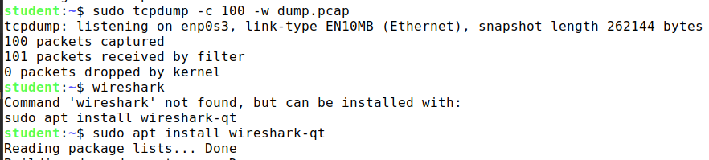

Открыл дамп:

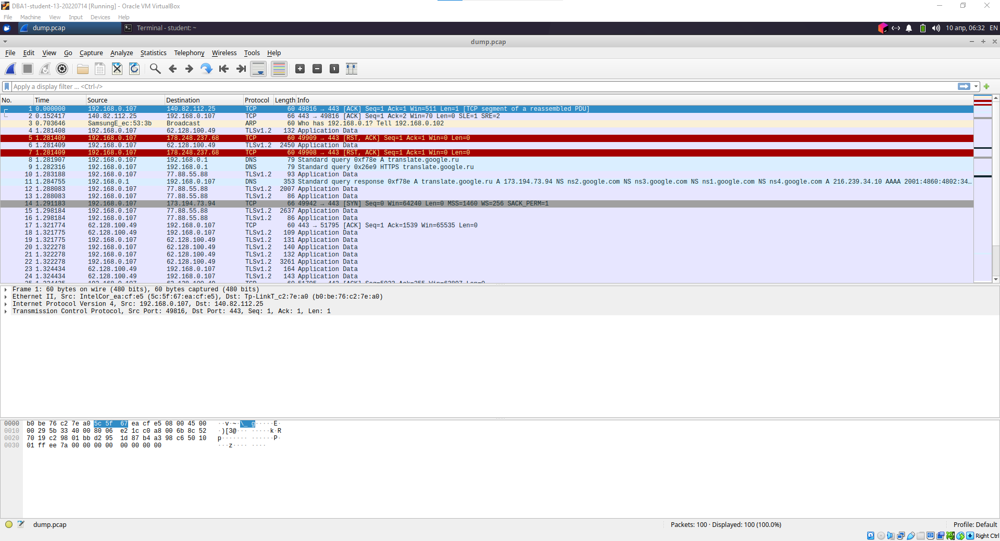

### 8. Просканируйте хост scanme.nmap.org. Какие сервисы запущены?

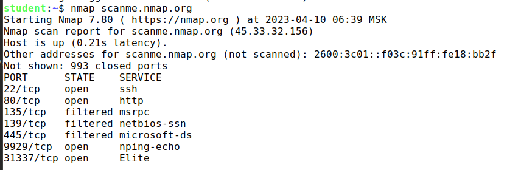

