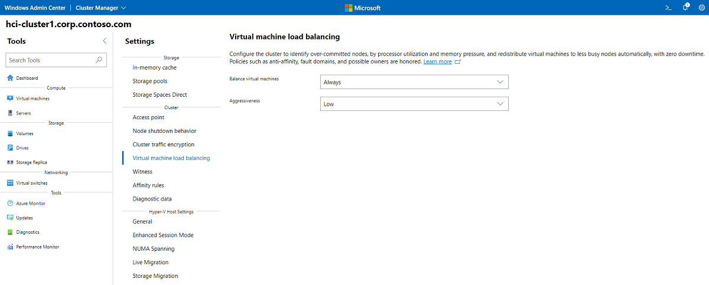
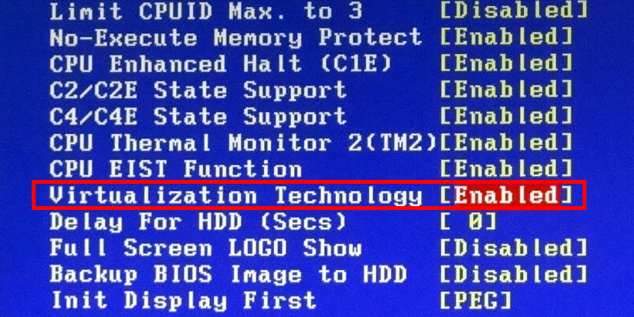
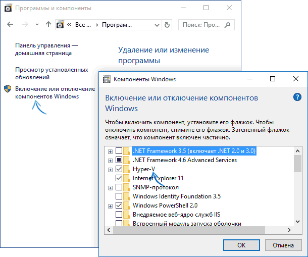

# Домашнее задание к занятию "5.2. Системы управления виртуализацией"

### 1. Выберите подходящую систему управления виртуализацией для предложенного сценария. Детально опишите ваш выбор.

Сценарии:

1) 100 виртуальных машин на базе Linux и Windows, общие задачи, нет особых требований

Возможно, будет проще прибегнуть к технологии Iaas (например, AWS или OpenStack). Потому что не нужно обслуживать и
содержать железо, которое должно быть из серии enterprise, ведь даже если выделить по 1ГБ оперативной памяти - это уже 100ГБ.

Можно использовать бесплатные решения - KVM, Xen или Vagrant. Ограничений на количество машин я не нашел.

Коммерческие продукты часто лицензируются по количеству используемых ядер или процессоров, что в данном случае
сказывается не положительым образом.

2) Преимущественно Windows based инфраструктура, требуется реализация программных балансировщиков нагрузки, репликации данных и автоматизированного механизма создания резервных копий

Всем необходимым функционалом обладает Hyper-V. Виртуальные машины Windows лучше поднимать на Windows:)
Для баланса нагрузки можно воспользоваться Windows Admin Center:



Репликация:

```
Реплика Hyper-V является неотъемлемой частью роли Hyper-V. Это способствует стратегии аварийного 
восстановления, реплицируя виртуальные машины с одного сервера узла Hyper-V на другой, чтобы обеспечить
доступность рабочих нагрузок. Реплика Hyper-V создает копию динамической виртуальной машины на реплику 
автономной виртуальной машины. 
(https://learn.microsoft.com/ru-ru/windows-server/virtualization/hyper-v/manage/set-up-hyper-v-replica)
```

Автономное резервное копирование так же поддерживается (https://learn.microsoft.com/ru-RU/system-center/dpm/back-up-hyper-v-virtual-machines?view=sc-dpm-2016)

В качестве аналога можно предложить VMWare. По производительности и цене они примерно на одном уровне.

3) Требуется наиболее производительное бесплатное opensource решение для виртуализации небольшой (20 серверов) инфраструктуры Linux и Windows виртуальных машин

Лучше использовать KVM, так как поддержка Windows здесь лучше, чем в Xen.

4) Необходимо бесплатное, максимально совместимое и производительное решение для виртуализации Windows инфраструктуры

- Hyper-V
- KVM
- VirtualBox


5) Необходимо рабочее окружение для тестирования программного продукта на нескольких дистрибутивах Linux

Вероятно, достаточно будет бесплатного решения на основе Xen или KVM

### 2. Опишите сценарий миграции с VMware vSphere на Hyper-V для Linux и Windows виртуальных машин. Детально опишите необходимые шаги для использования всех преимуществ Hyper-V для Windows.

Миграция = перенос жесткого диска с одного гипервизора на другой. Проблема в том, что жесткие диски хранятся 
в разных форматах.

Для конвертации форматов можно воспользоваться утилитой StarWind V2V или Virtual Machine Wizard.

После конвертации появляется фалй с расширением VHD (VHDX).

При создании виртуальной машины нужно указать существующий жесткий диск. Тот, который получили на предыдущем шаге.

По идее, процесс конвертации не должен отличаться наа разных гостевых ОС. Возможно, у Linux будет несколько жестких дисков, из-за того, 
что там несколько системных разделов.

Для использования hyper-v нужно:
- включить ппаратную виртулизацию на уровне процессора.


- включить компонент hyper-v.


### 3. Опишите возможные проблемы и недостатки гетерогенной среды виртуализации (использования нескольких систем управления виртуализацией одновременно) и что необходимо сделать для минимизации этих рисков и проблем. Если бы у вас был бы выбор, то создавали ли вы бы гетерогенную среду или нет? Мотивируйте ваш ответ примерами.

Например, на Windows 10 не получится одновременно использовать VirtualBox (полная виртуализация и 
паравиртуализация) и docker (виртуализация уровня ОС). Потому что они будут бороться за Hyper-V.

1) Поэтому очевидный недостаток - конфликт ПО за ресурсы и компоненты системы.

2) Так же могут возникнуть сложности при администрировании и развертывании. 
Сложность управления: гетерогенная среда виртуализации создает сложности при управлении из-за необходимости использования различных интерфейсов управления и управляющих систем.

3) Проблемы на одной системе виртуализации могут сказаться (и даже положить) другую систему виртуализации и хост.
 
4) Различные требования: различные системы виртуализации могут иметь различные требования по ресурсам, что может привести к неэффективному использованию оборудования.


Поэтому, я считаю, что если есть возможность отказаться от гетерогенности, то это лучше сделать.