# Домашнее задание к занятию "5.3. Контейнеризация на примере Docker"

### 1. Подходит ли в этом сценарии использование докера? Или лучше подойдет виртуальная машина, физическая машина? Или возможны разные варианты?

- Высоконагруженное монолитное java веб-приложение;

Высокая нагруженность предполагает активную работу с выделенными ресурсами. Проще управлять ресурсами будет в виртуальной машине

- Go-микросервис для генерации отчетов;

Генерация отчета - большая нагрузка на Out операции. Другой вопрос, что формирование отчета, 
как правило, не частая операция. Поэтому можно пожертвовать производительностью и развернуть микросервис в докере.

- Nodejs веб-приложение;

Невысокая нагрузка, не много ресурсов - контейнеры.

- Мобильное приложение c версиями для Android и iOS;

Для мобльных приложений свойственно разное поведение на разных ОС и версиях ОС. Поэтому оперативное развертывание 
контейнера с различными версиями - отличное решение для ускорения тестирования и отладки приложения.

- База данных postgresql используемая, как кэш;

Раз БД будет использоваться как кэш, то предполагается, что доступ и операции IO должны быть очень быстрыми.
Поэтому лучше не тратить ресурсы на виртуализацию и развернуть БД на физическом сервере.

- Шина данных на базе Apache Kafka;

Опять же - шина данных подразумевает активные операции IO, значит лучше физический сервер.
Хотя с другой стороны, много узлов легче развертывать в контейнере. 

- Очередь для Logstash на базе Redis;

Несколько узлов с невысокой нагрузкой, требующие не много ресурсов - контейнеры.

- Elastic stack для реализации логирования продуктивного веб-приложения - три ноды elasticsearch, два logstash и две ноды kibana;

Несколько узлов с невысокой нагрузкой, требующие не много ресурсов - контейнеры.

- Мониторинг-стек на базе prometheus и grafana;

Несколько узлов с невысокой нагрузкой, требующие не много ресурсов - контейнеры.

- Mongodb, как основное хранилище данных для java-приложения;

Для БД лучше физический сервер. Но если работа с БД не очень активная, то лучше использовать контейнеры.

- Jenkins-сервер.

Есть официальный докер-образ:

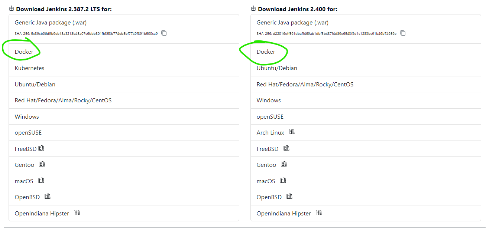

### 2. Запуск веб-сервера в фоне с индекс-страницей, содержащей HTML-код

Скачал образ httpd, содержащий apache2:

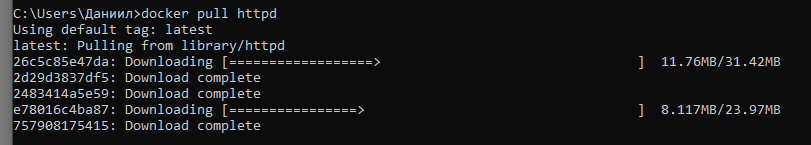

Проверил список образов через консоль и Docker Desctop:

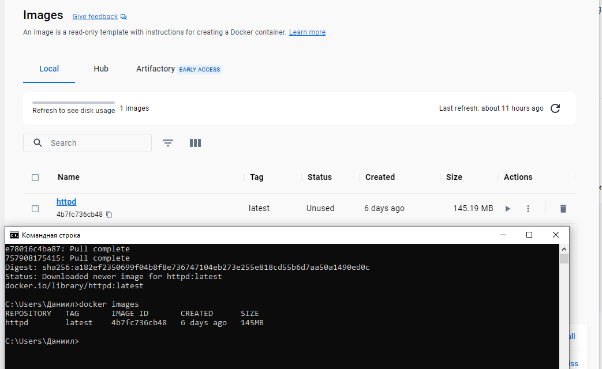

Запустил контейнер и проверил работоспособность в браузере. Apache поднялся самостоятеьлно:

Нашел файл index.html:

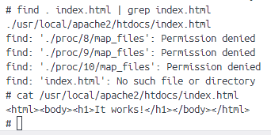

Заменил его содержимое:

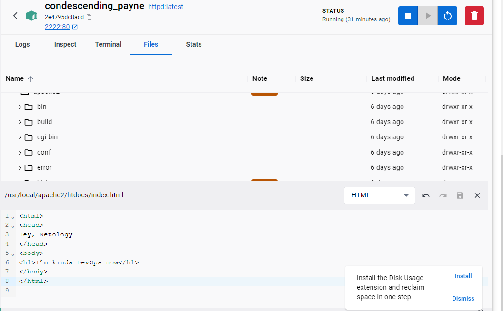

Будем считать, что работает:)

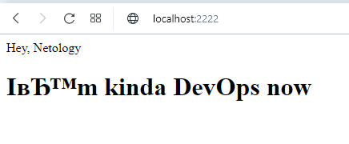

#### Обновление от 20.04.2023

После перезапуска контейнера сбросились изменения:

Еще раз изменил файл и создал образ из контейнера:

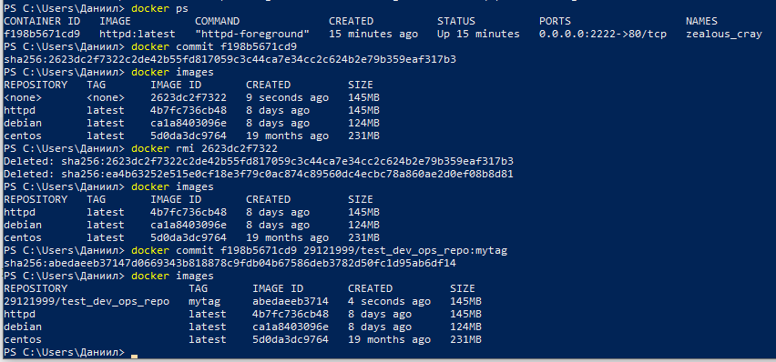

Отправил изменения на dockerHub:

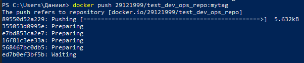

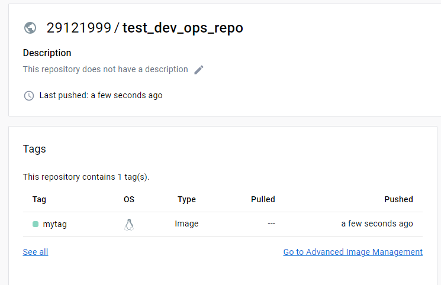

Создал контейнер из нового образа на другом порту, изменения файла зафиксированы:  

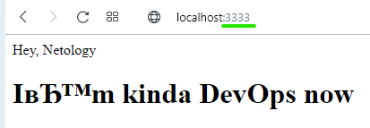

### 3. Работа с расшареными директориями.

Создал контейнеры debian и centOs:

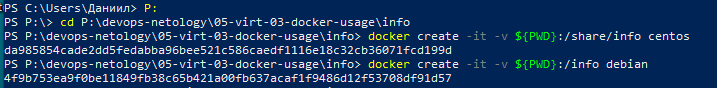

Проверил факт создания и посмотрел ID:

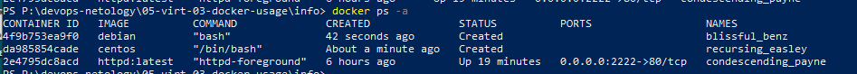

Запустил debian и проверил, что целевая папка пуста:

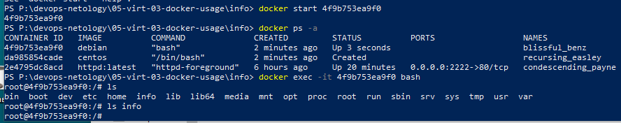

Создал файл в целевой папке через контейнер:

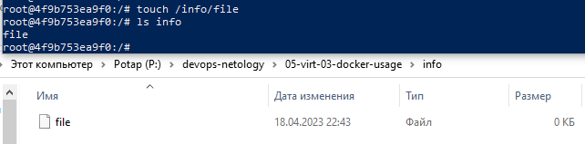

Создал файл в целевой папке через хост: 

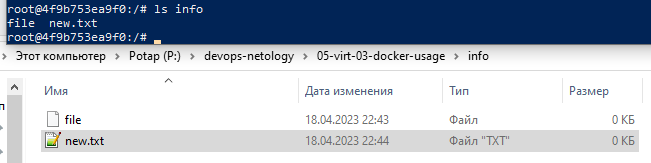

Запустил centos и убедился, что файлы присутствуют в целевой директории:

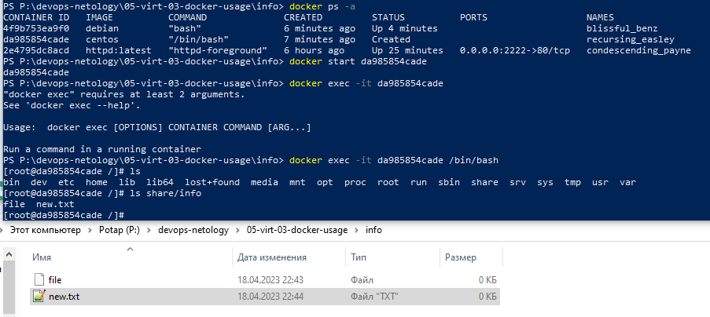

