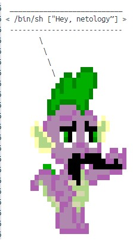

# Домашнее задание к занятию "5.4. Практические навыки работы с Docker"

### 1. Измените базовый образ предложенного Dockerfile на Arch Linux c сохранением его функциональности.

https://hub.docker.com/repository/docker/29121999/test_arch/general

Для начала проверил исходный образ:

Изменил dockerfile следующим образом:

Выполнил сборку из образа:

Запустил контейнер (через docker desktop):

Правда запустить через консоль так и не получилось. Исполняемую команду я не передаю, но по идее должна была отработать 
команда Ponysay в терминале, а затем контейнер должен был завершить работу. 

### 2. В данной задаче вы составите несколько разных Dockerfile для проекта Jenkins, опубликуем образ в dockerhub.io и посмотрим логи этих контейнеров.

Скачал репозиторий с официальным образом Jenkins:

Собрал его и запустил. Сервис стартовал автоматически:

Аналогичный способ, только без сборки образа локально, а со скачиванием образа из репозитория:

Установил Amazon Linux, но запустить на нем jenkins не удалось:

Так же при попытке внести изменения в исходный dockerfile jenkins все время натыкался на ошибку:

### 3. Объединение контейнеров в сеть

Попытался собрать образ nodejs из исходного dockerfile и запустить его. Но с первого раза не получилось:

Хотя файл есть:

Со второй попытки удалось запустить контейнер. Затем отредактировал dockerfile, добавив строки:

Но запустить simplicity не удалось. Не то что через dockerfile, даже через консоль.

Создал новый мост:

Проверил его наличие:

Запустил контейнер ubuntu в новой сети:

Запустил контейнер с npm приложением в новой сети:

Проверил, что контейнеры действительно находятся в одной сети:

Затем нашел чужую домашку на гите:) 

Собрал образ из этого dockerfile:

На хосте стал доступен сайт:

После установки утилиты curl на ubuntu:

