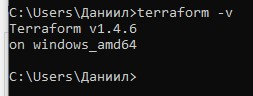
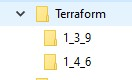
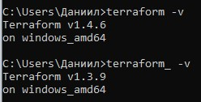

# Домашнее задание к занятию "7.1. Инфраструктура как код"

### 1. Выбор инструментов.

В проекте будет большое количество небольших релизов, тестирований, интеграций, откатов, доработок.

1.1. Удобнее будет работать с изменяемой архитектурой, так как часто нужно будет вносить правки в образа. При этом на этапе разработки
не так критичны различия между тестовыми прогонами и продакшеном.

1.2. Так как используются Ansible и Terraform, то напрашивается отсутствие центрального сервера.

1.3. По той же причине напрашивается отсутствие агентов.

1.4. Да, за это будет отвечать terraform

2.1. Terraform, Ansible, Packer, Docker, Kubernetes

### 2. Установка терраформ.

Скачал exe с официльного сайта.

Создал каталог Terraform в Program Files (x86) и переместил в него exe.

Добавил новый путь в Path.

### 3. Поддержка легаси кода.

В каталоге Terraform создал дв подкаталога с номерами версий:

Переименовал раннюю версию (добавил нижнее подчеркивание в конец).

Обновил переменную PATH.

Использоваание разных версий:

