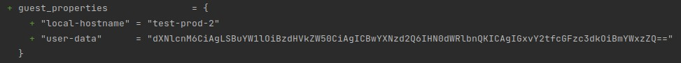

# Домашнее задание к занятию "7.2"

### Вывод команды terraform workspace list

### Вывод команды terraform plan для воркспейса prod

### [Ссылка на содержимое фалов terraform](./terraform_project)

### Созданные машины

### Зависимость инстанса от воркспейса

Раздел locals:

Ресурс виртуальной машины:

### Указание количества экземпляров

Раздел locals:

Указание количества в ресурсе виртуальной машины:

### Подсети

Описание сети в ресурсе ВМ:

Ресурс сети с указанием диапазона адресов в зависимости от инстанса:

Маска подсети не указана, но распределение адресов соблюдено.

Раздел locals:

Список сетей в VMware Cloud Director:

Не получается выполнить terraform apply за один раз. Первое выполнение завершается ошибкой, но вторая попытка 
удается. Та же история с terraform destroy.

### Увеличение диска

Скрипт, увеличивающий объем диска:

Указание нового объема диска:

Если оставить у stage объем неизменным, то, вероятно, скрипт завершается с ошибкой, потому что в таком 
случае не удается авторизоваться в системе. Правильнее было бы добавить два разных скрипта, которые выполнялись бы
в зависимости от воркспейса, а не менять размер диска у stage.

### Добавление пользователя

Так и не удалось добавить пользователя через код. 

Пользователи после создания ВМ:

Хотя данные отображаются в плане:

И до них можно добраться из самой машины:

Были использованы различные варианты конфига, но ни один не привел к созданию пользователя, например:

Вариант 1:

Вариант 2:

Вариант 3:

Вариант 4:

### Outputs

Вывод:

