# Домашнее задание к занятию "12.01 Компоненты Kubernetes"

Использовал установленную ранее виртуальную машину в VWware CD, с настроенным доступом по ssh.

Установил minikube:

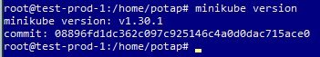

Без crictl не запустился:

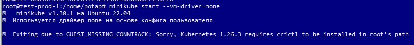

Установил crictl:

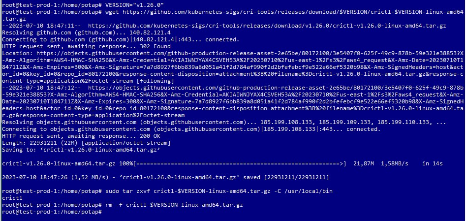

Не смотря на то, что vm-driver указан none, без cri-docker minikube снова не запустился:

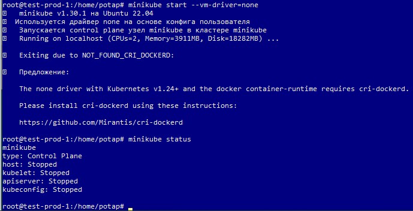

Приступил у установке cri-docker:

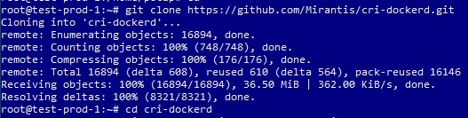

Во время выполнения скрипта понадобился go:

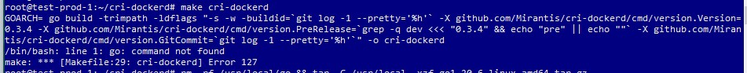

Установил go:

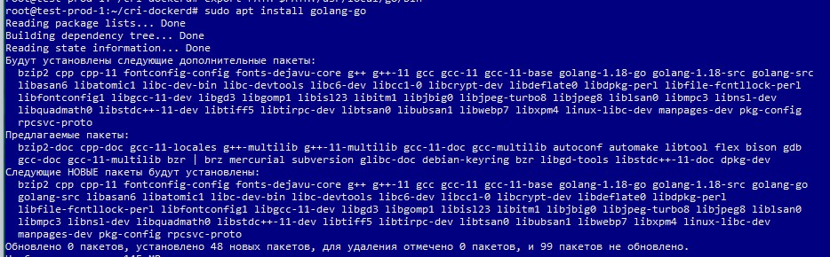

Завершил установку cri-docker:

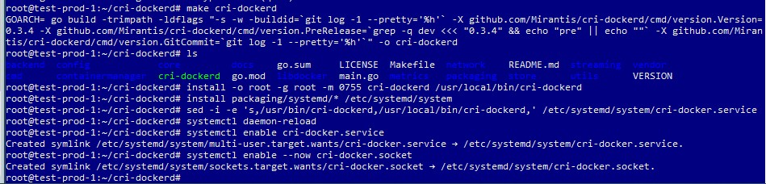

Теперь minikube запускается:

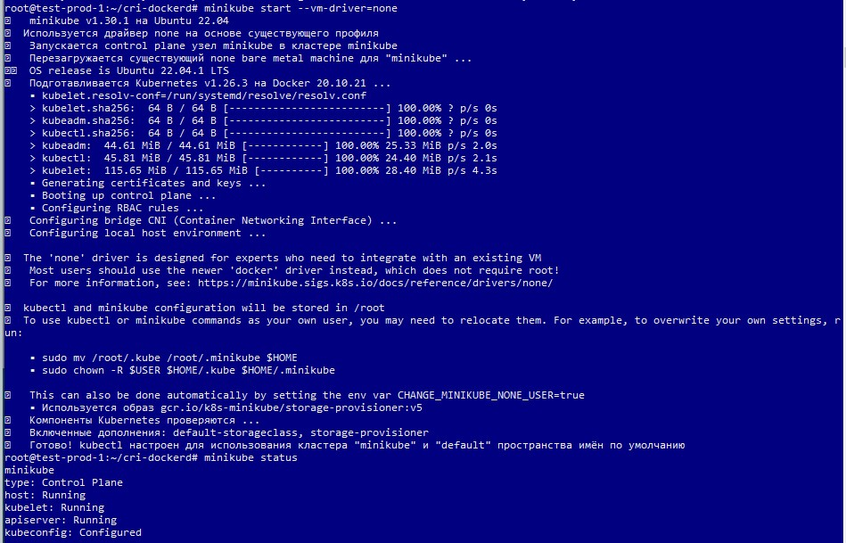

Запустить dashboard не удалось, так как после значительного времени ожидания управление консоли не возвращалось. 
Вероятно это связано с тем, что у ВМ нет графического интерфейса. Хотя если доступ осуществляется через ip адрес и порт,
то проблемы быть не должно.
Пришлось принудительно прекратить выполнение команды:

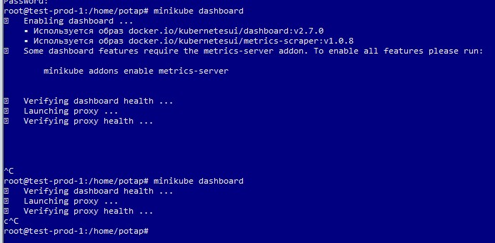

Выполнил команды по туториалу:
(Подряд и бездумно - безрезультатно)

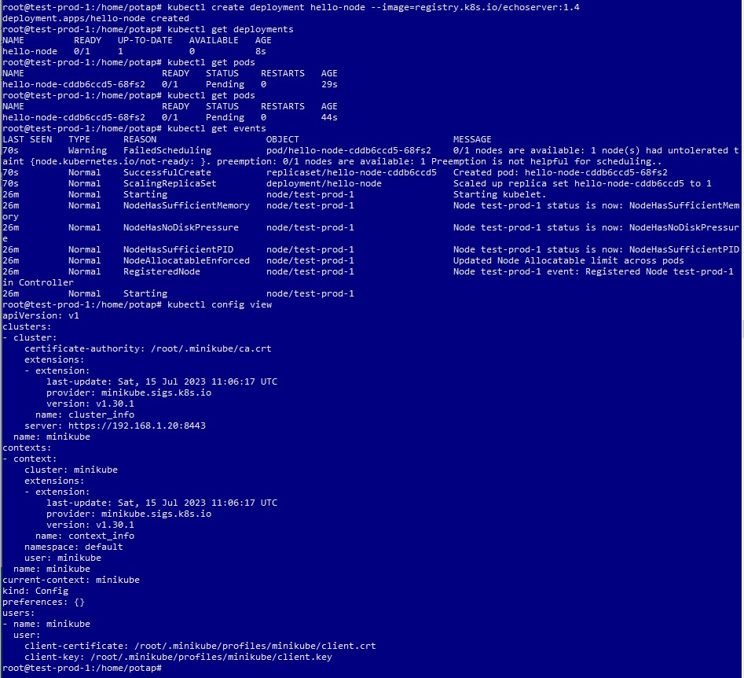

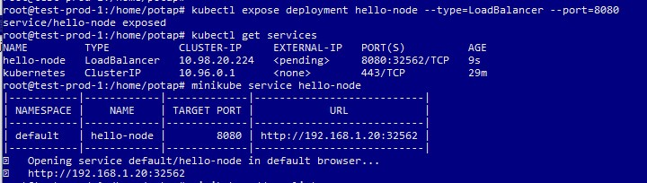

Попытался настроить проброс портов. Если с ssh все понятно:
- внешний порт - 22
- внутренний порт тоже 22, указан в ssh.

То с hello-node не все так просто. Я могу указать порт, который буду слушать (на скриншоте 33333), но указать 
с какого порта передавать данные - указать не могу (только если выбрать приложение с нужным портом, что, вероятно,
не правильно).

Естественно, результата в браузере не было.

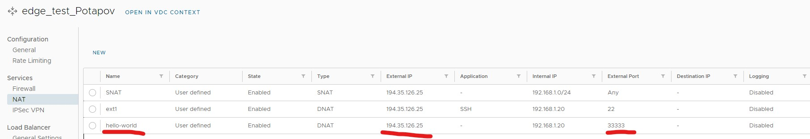

Затем появились сомнения, что hello-node запущен, так как статусы везде "not ready". Поэтому запустил 
minikube без явного указания драйвера:

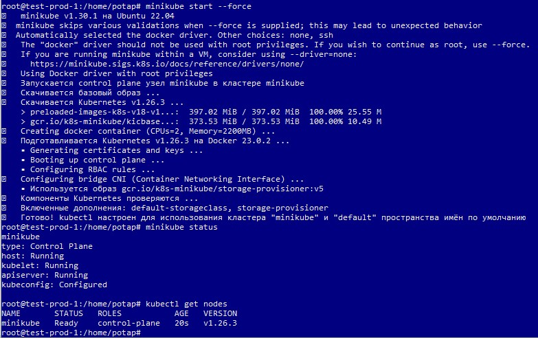

Теперь деплойменты и поды запускаются:

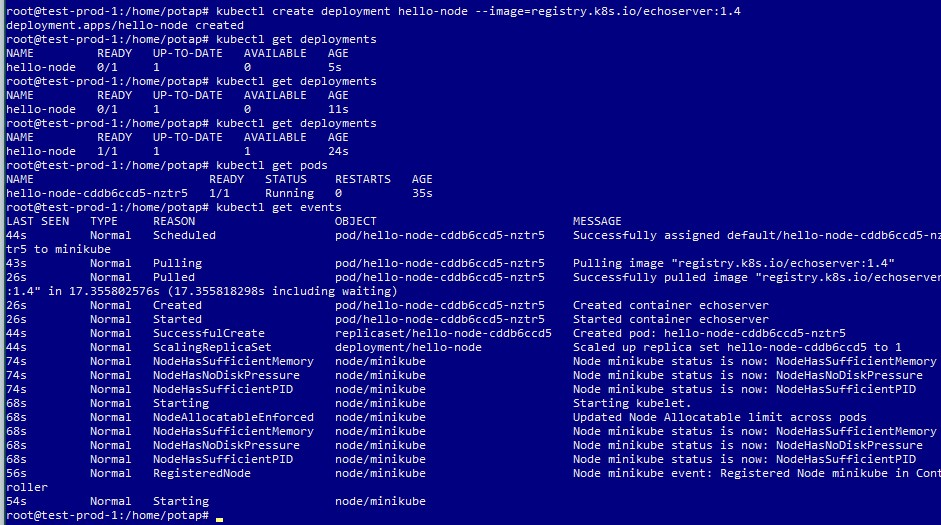

Вывод конфига:

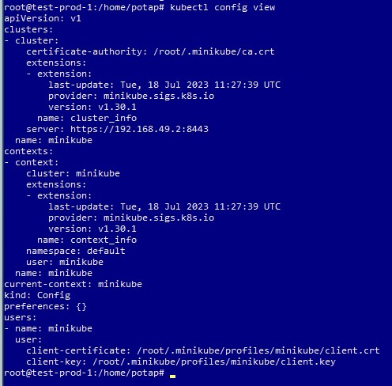

Открыл доступ для доступа вне кластера:

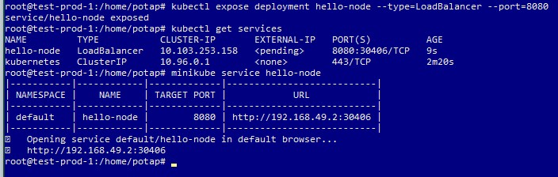

На самом деле, на этом этапе начинается путаница с адресами. Не понятно, как правильно получить доступ к сервису из вне.

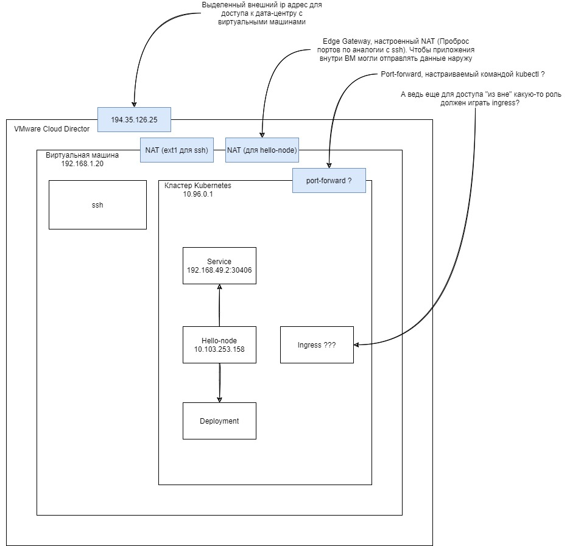

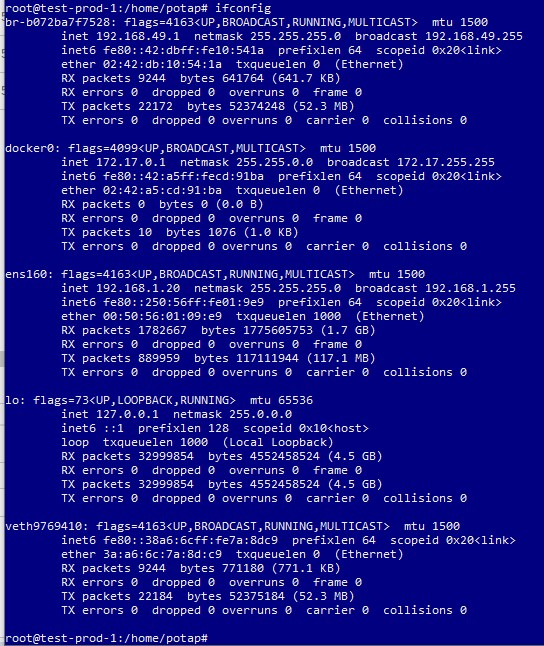

Получается, нужно произвести настройку в трех местах:
- настроить на уровне kubernetes (kubectl port-forward ...), чтобы приложение было видно за рамками кластера.
- настроить на уровне виртуальной машины, чтобы данные от кластера kubernetes передавались на определенный порт.
- настроить на уровне vmware CD, чтобы данные от виртуальной машины передавались через edge gateway.

Плюс в лекции 12.03 будет сказано, что кластер может не запускаться (статус "not ready", как в начале отчета) из-за отсутствия 
сетевых плагинов, что тоже может повлиять на доступность приложения.

Включение аддонов:

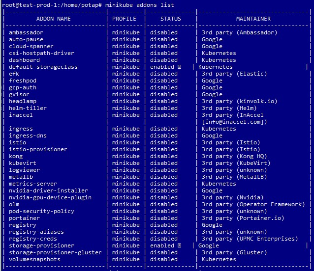
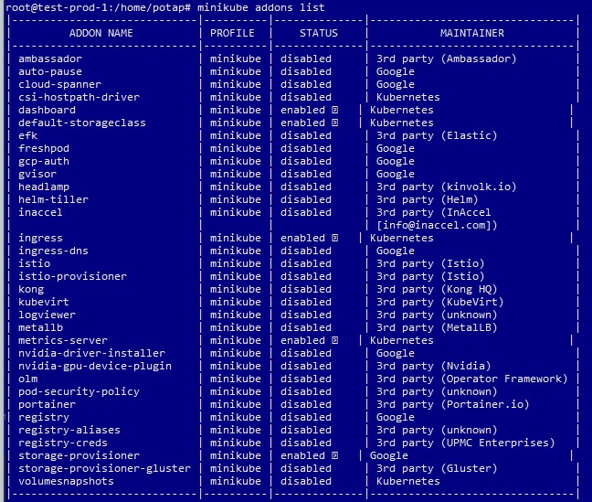

