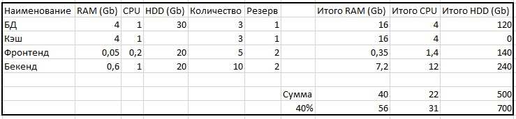
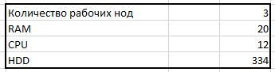

# Домашнее задание к занятию "12.3 Развертывание кластера на собственных серверах, лекция 1"

Будем считать, что для кэша и БД нужно по одной резервной копии, а для бекенда и фронтенда по две.
Так же находил информацию, что ресурсов должно быть на 40% больше, чтобы недееспособность одной из нод не влияла 
на работу приложения в целом.

На функционирование приложения необходимо:

В таком случае, получается, что на 3 ноды нужно (с учетом ресурсов на функционование самой ноды):

Для управления кластером нужно 3 ноды с характеристиками:

