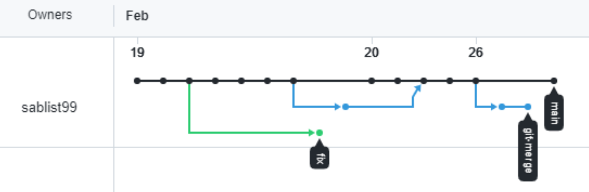
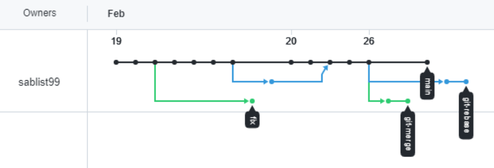
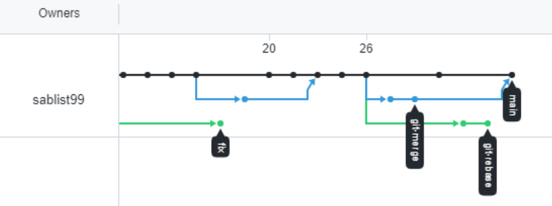
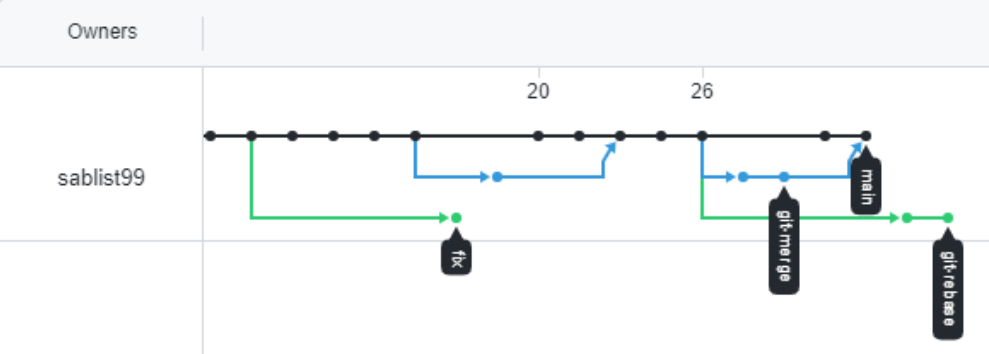
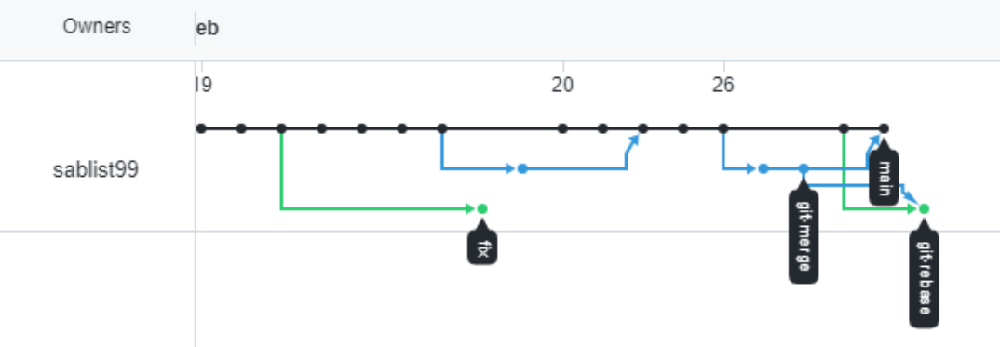

# devops-netology

После подготовки файла merge.sh и изменения main:

После добавления ветки git-rebase:

Во время выполнения merge была использована стратегия ort, а не recursive, как в курсе. Почему-то не работает git push. Приходится выполнять git push origin main. Результат:

Картинка немного поменялась. Из-за ошибки во время rebase пришлось пересоздать ветку:

После выполнения rebase получился следующий результат. Есть подозрение, что должно быть не так. Поэтому повторю все действия по новой.

Начал выполнять по новой:

После выполнения rebase:

После выполнения merge:
